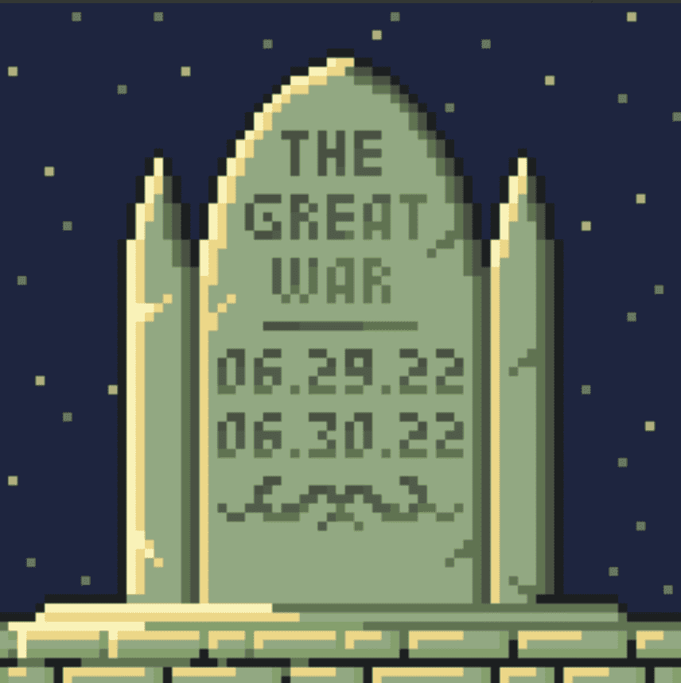

# Moonrunners: History of Primordia

- **10,000 初始供应**
- **没有路线图**
- **没有不和谐**
- **CC0**
- **即时显示**
- **7.5% 版税**
- **5%（为团队保留 500 个）**
- **故事驱动，是时候组装你的 WolfPack**

**Moonrunners正在接管**

10,000 个手工制作的 PFP 的集合。这头狼群在人类的原原大陆上和睦相处了最长的时间，但一个月将永远改变历史的进程，现在深红的满月又一次来临了……

**常见问题**

**有不和谐吗？
**不，我们是一个专注于 Twitter 的项目。我们想消除噪音，需要去 Discord 以保持最新状态。

**薄荷的价格是多少？
**免费+天然气。每个钱包 2 分钟。

**什么是 CCO？
**CC0。这意味着 NFT 集合没有版权。您可以修改、分发和执行作品，甚至用于商业目的，无需征得许

**我在哪里可以买到 Moonrunners？
**通过上面的铸造，然后在二级市场上，通过 OpenSea、X2Y2 和 LooksRare。

