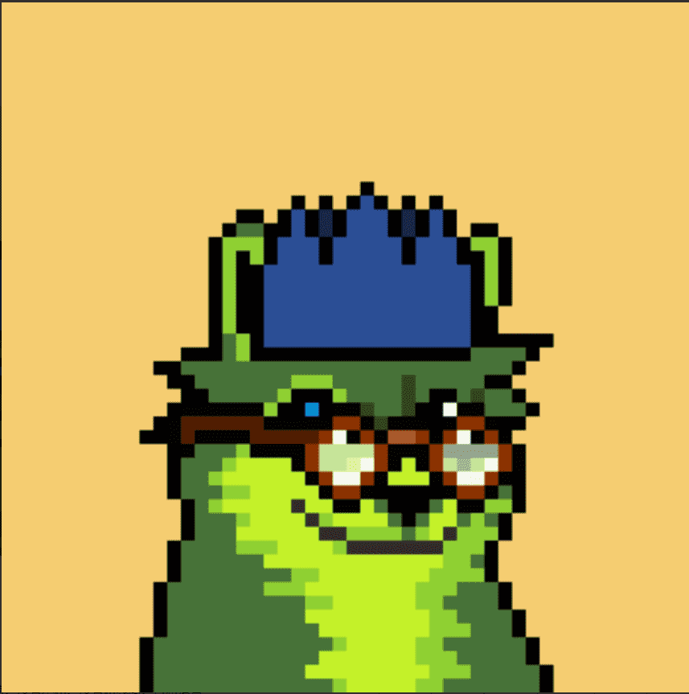

# Moonrunners Official

**常见问题**

**有不和谐吗？
**不，我们是一个专注于 Twitter 的项目。我们想消除噪音，需要去 Discord 以保持最新状态。

**薄荷的价格是多少？
**免费+天然气。每个钱包 2 分钟。

**什么是 CCO？
**CC0。这意味着 NFT 集合没有版权。您可以修改、分发和执行作品，甚至用于商业目的，无需征得许

**我在哪里可以买到 Moonrunners？

**通过上面的铸造，然后在二级市场上，通过 OpenSea、X2Y2 和 LooksRare。

**什么是实用程序/路线图？
**我们厌倦了看到为了获得信任而提出的 BS 路线图。相反，我们的目标是承诺不足和超额交付。在 Twitter 上关注故事并享受旅程，我们有很多东西可以提供。

**‍ 团队中有谁**

 我们是一个由来自全球的 8 人组成的团队，其中包括艺术家、开发人员、传说作家和顾问，他们都是具有项目经验的 NFT 本地人。

