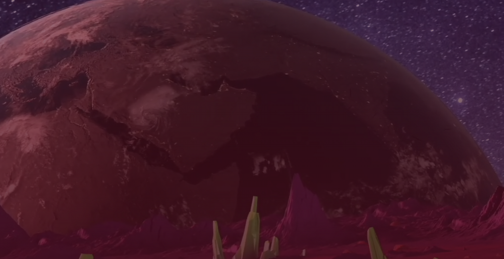

# Moonscape

在 Moonscape 中，玩家探索未来主义的月亮，使用 DeFi 功能增强他们的城镇，并为他们在游戏中花费的时间获得奖励。在这款下一代 web3 战略史诗中，玩家将创建城市、争夺资源并为争夺月球霸权而战。

该项目是 DeFi 游戏在整个加密圈传播的宇宙浪潮的第一步。在 Lighthouse 上，用户可以在 DeFi Gaming 中找到新的项目，以提供经济支持并获得回报。第一个项目是一个资源管理策略游戏，发生在未来月球的废墟上。

建设和发展你的城市以增强你的力量。为每栋建筑选择两种类型的功能，一种帮助您改善城市和漫游者，另一种提供有吸引力的质押选项的 DeFi 功能。建造漫游者和提取器在土地上漫游以寻找有限的资源。升级您的建筑物和机器，同时增加您的收入潜力。所有的城市都可以变成 NFT 进行铸造、交易和销售，让勤劳的玩家获利。

