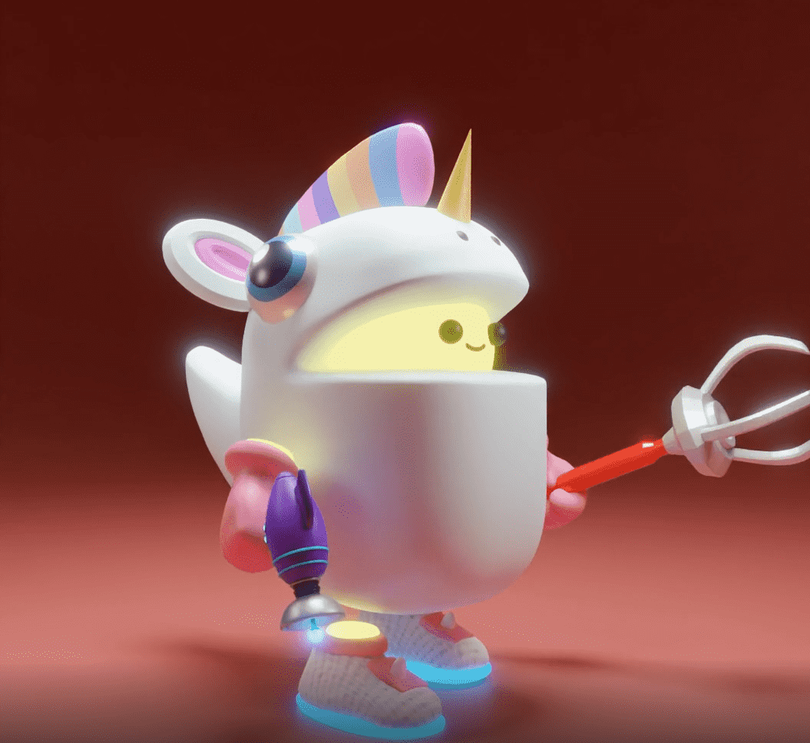

# Moonsie Collection

**5,555 NFTS 收藏**

Moonsie 是对社交游戏世界的调皮和新鲜的诠释。带上你的 Moonsie，加入这场盛会！这个有限的铸币活动是进入 Moonsie 宇宙的门户。

**收藏有多大？**

Moonsie 是 5,555 个 3D 全动画 NFT 的集合。

**薄荷的价格是多少？**

0.055 以太币

**如果我有月单，我可以铸造多少?**

在我们的预售活动期间，每个 Moonlist 都是 1 分钟的预订。

##### ▶ 什么是 Moonsie 系列？

Moonsie Collection 是一个 NFT（非同质代币）集合。存储在区块链上的数字艺术品集合。

##### ▶ 有多少个 Moonsie Collection 代币？

总共有 3,000 个 Moonsie Collection NFT。目前，1,431 位车主的钱包中至少有一个 Moonsie Collection NTF。

##### ▶ 最昂贵的 Moonsie Collection 拍卖会是什么？

最昂贵的 Moonsie Collection NFT 是 Moonsie #578。它于 2022-06-20（3 个月前）以 219.6 美元的价格售出。

##### ▶ 最近卖出了多少Moonsie Collection？

在过去 30 天内售出了 371 个 Moonsie Collection NFT。

##### ▶ Moonsie 系列的价格是多少？

在过去 30 天里，Moonsie Collection NFT 最便宜的销售额低于 21 美元，最高销售额超过 99 美元。Moonsie Collection NFT 的中位价格在过去 30 天内为 50 美元

