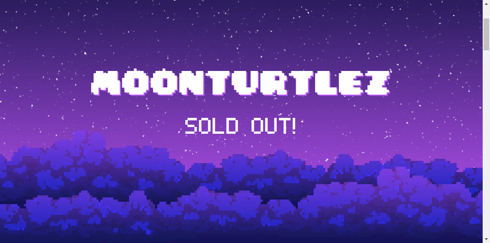

# MoonTurtlez.wtf

▶ 什么是 Moonturtlez？
Moonturtlez 是一个 NFT（不可替代令牌）集合。存储在区块链上的数字艺术品集合。
▶ 有多少个 Moonturtlez 代币？
总共有 8,888 个 Moonturtlez NFT。目前，3,938 位车主的钱包中至少有一个 Moonturtlez NTF。
▶ 最昂贵的 Moonturtlez 销售是什么？
售出的最昂贵的 Moonturtlez NFT 是 #2475。它于 2022 年 6 月 28 日（2 个月前）以 220 美元的价格售出。
▶ 最近卖出了多少个 Moonturtlez？
过去 30 天内共售出 9,784 个 Moonturtlez NFT。
▶ Moonturtlez 多少钱？
在过去 30 天里，Moonturtlez NFT 最便宜的销售额低于 20 美元，最高销售额超过 97 美元。Moonturtlez NFT 在过去 30 天内的中位价格为 47 美元。
▶ 什么是流行的 Moonturtlez 替代品？
许多拥有 Moonturtlez NFT 的用户还拥有 Moonrunners Official、 Monkerunners Official、 MoonPepes和 BBYC Bored Bits Yacht Club。

