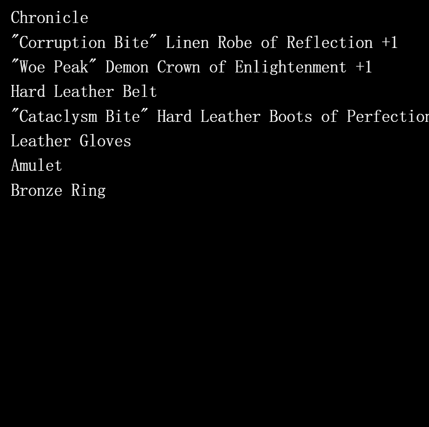
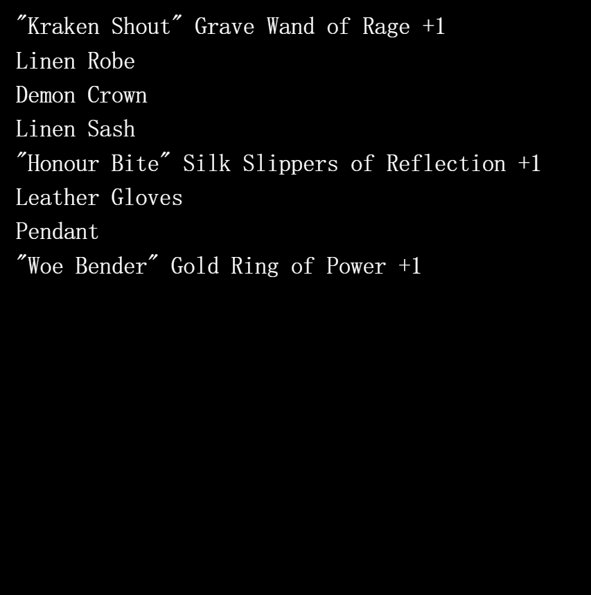

# More Loot on Polygon

More Loot on Polygon 的总销售额为 4.6 美元。Polygon NFT 上一个 More Loot 的平均价格为 4.6 美元。Polygon 拥有 199 名更多战利品，总共拥有 3,358 个代币。

##### ▶ 什么是多边形上的更多战利品？

多边形上的更多战利品是 NFT（不可替代令牌）集合。存储在区块链上的数字艺术品集合。

##### ▶ Polygon 代币还有多少战利品？

Polygon NFT 上总共有 3,358 个战利品。目前，199 位所有者的钱包中至少有一个关于 Polygon NTF 的 More Loot。

##### ▶ 什么是最昂贵的多边形销售更多战利品？

Polygon NFT 上出售的最昂贵的 More Loot 是 Bag #321382。它于 2022-09-01（7 天前）以 4.6 美元的价格售出。

##### ▶ 最近在 Polygon 上卖出了多少个战利品？

在过去 30 天内，Polygon NFT 上售出了 3 个战利品。

