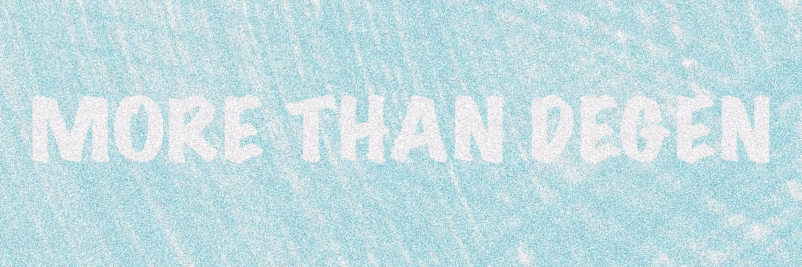

# More Than Degen

创建于 3 个月前

5,000 代币供应

0% 费用

刷新

过去 7 天没有超过 Degen 的销量。

Th3y 称我们为 degens，但我们是 m0re！我们是 shcollectors 和 trad3rs。我们 shlove Web3 和 p!zza！艺术驱动和 f0r degens 的 l0ve。0% 的版税。

推特：@MoreThanDeg

薄荷：超过-degen-nft.com

不仅仅是 Degen NFT - 常见问题（FAQ）
▶ 什么是超越退化？
More Than Degen 是一个 NFT（不可替代代币）集合。存储在区块链上的数字艺术品集合。
▶ 有多少超过 Degen 代币？
总共有 5,000 多个 Than Degen NFT。目前，331 位所有者的钱包中至少有一个 More Than Degen NTF。
▶ 最近卖出了多少比德根？
过去 30 天内售出 0 件超过 Degen NFT。

