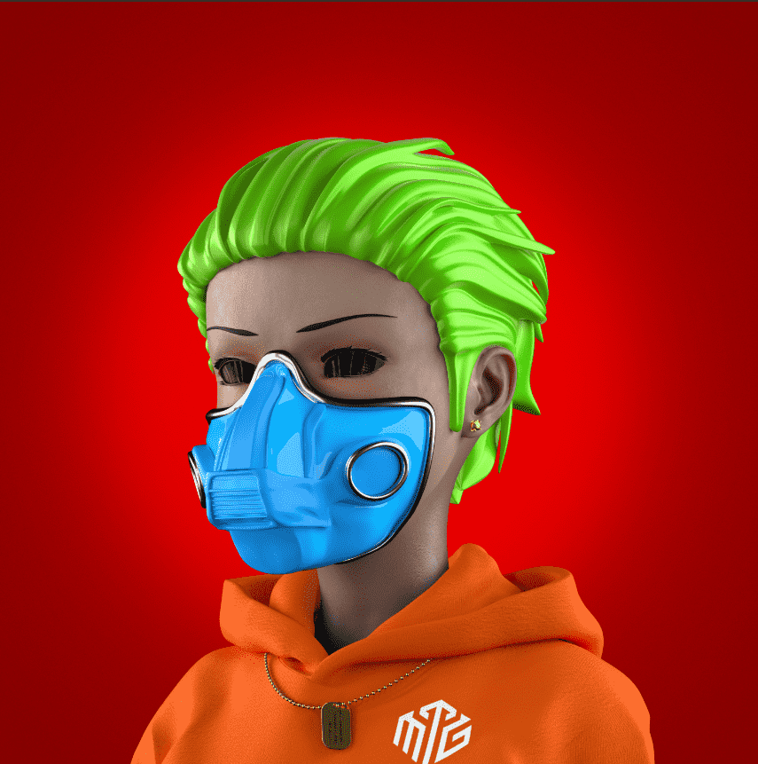
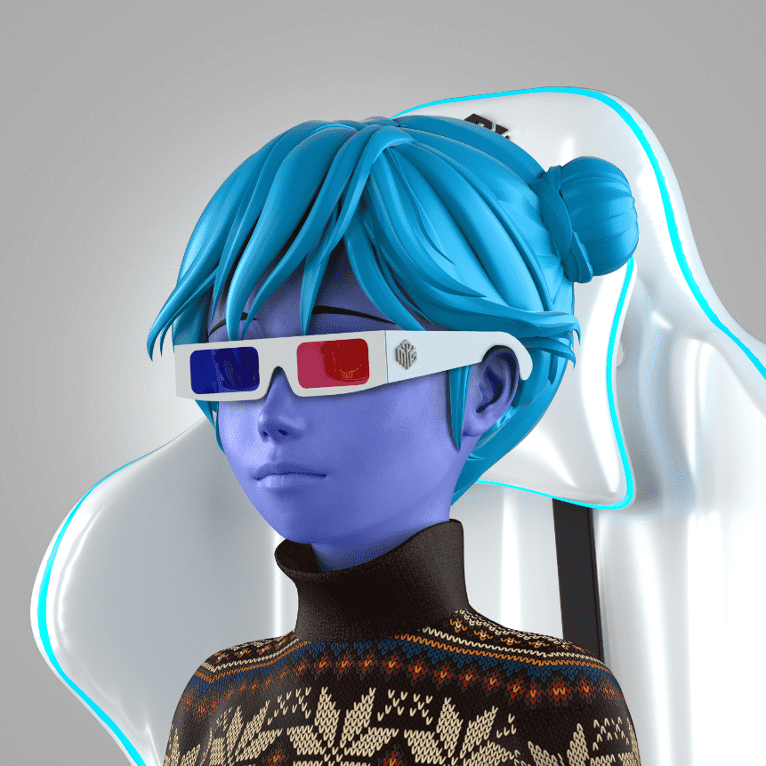

# More Than Gamers | MTG

## 起源故事

他们所知道的世界早已不复存在。精英皇室阶层的崛起使社会其他部分陷入混乱。经济不平等、仇恨和分裂已成为常态。玩家现在必须在元宇宙中战斗以赚取 $Arcada 才能生存。$Arcada 规则游戏社会等级取决于一个人持有多少 $Arcada。玩的越多，他们赚的 $Arcada 就越多。购买所有必需品都需要 $Arcada。然而，谣言一直在传播……收集足够的$Arcada，您也许可以突破经济阶层的束缚。精英们是真的满足了，还是他们也处于更高权力的秘密控制之下？但这只是旅程的开始……

##### ▶ 什么是游戏玩家以上 | 万智牌？

不仅仅是游戏玩家 | MTG 是一个 NFT（Non-fungible token）集合。存储在区块链上的数字艺术品集合。

##### ▶ 比游戏玩家多多少 | MTG代币存在吗？

总共有 10,100 多名游戏玩家 | MTG NFT。目前 3,007 位车主至少拥有一个 More Than Gamers | MTG NTF 在他们的钱包里。

##### ▶ 比游戏玩家最贵的是什么 | 万智牌出售？

最贵的不仅仅是游戏玩家| 出售的 MTG NFT 是 Royal Gamer #1。它于 2022 年 6 月 11 日（3 个月前）以 130 美元的价格售出。

##### ▶ 比游戏玩家多多少 | MTG最近卖了？

超过 227 位游戏玩家 | 过去 30 天内售出的 MTG NFT。

##### ▶ 比游戏玩家多多少 | 万智牌费用？

过去 30 天，More Than Gamers 最便宜 | MTG NFT 销售额低于 71 美元，最高销售额超过 202 美元。More Than Gamers 的中位数价格 | MTG NFT 在过去 30 天内为 108 美元。

