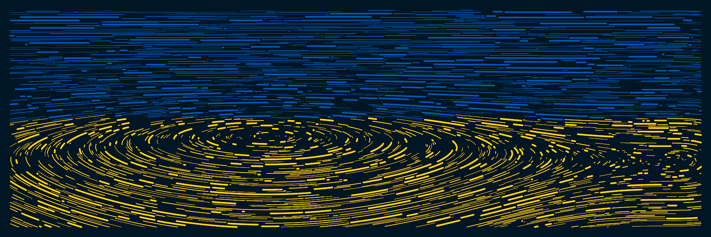

# Morpheu5 Series

Morpheu5 系列 NFT - 常见问题（FAQ）

▶ 什么是 Morpheu5 系列？
Morpheu5 系列是一个 NFT（非同质代币）集合。存储在区块链上的数字艺术品集合。
▶ Morpheu5 系列代币有多少？
总共有 6 个 Morpheu5 系列 NFT。目前 530 位车主的钱包中至少有一个 Morpheu5 系列 NTF。
▶ Morpheu5 系列最贵的是什么？
售出的最昂贵的 Morpheu5 系列 NFT 是 Surge Ukraine Emergence #0。它于 2022 年 6 月 29 日（2 个月前）以 3.3 美元的价格售出。
▶ Morpheu5 系列最近卖出了多少？
过去 30 天内售出 1 个 Morpheu5 系列 NFT。

