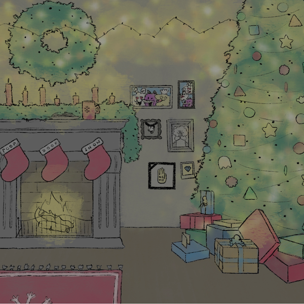

# Morphys

Morphys 是 10k 个独特的 1920 年代卡通人物，可以在链上改变他们的外观和特征。当新赛季开始时，所有者可以决定他的 Morphy 是否会变形为新的赛季外观。变形改变了它的外观和特征，有点像在你的 Flowtys 上穿上一套服装。这导致持有者社区集体决定哪些特征随着时间的推移变得最稀有。

如果您拥有 Flowty，您可以预览和铸造相应的 Morphy，并在其万圣节季节服装中进行制作。你保留了你的 Flowty NFT 和你的新 Morphy NFT。您的 Flowty 越老，您的 Morphy 铸造成本就越低。如果您在 Flowtys NFT 铸造的第一周内持有您的 Flowty，则铸造您的 Morphys 是免费的。 

铸造 Morphy NFT 可以获得一个新的 NFT，除了你的 Flowty NFT。

