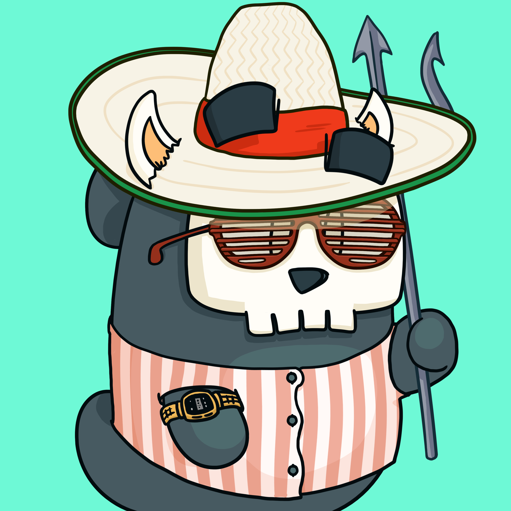

# Mortified! | MORT

在 web3 中无 FUD
我们正在打造排名第一的 web3-native 个人发展品牌，以帮助您减轻压力并每天感到更快乐。Mortiverse 是 web3-native 个人发展品牌，使 Stoic 哲学在文化上为下一代所接受。

第一季是一系列卡通和游戏，旨在克服压力和焦虑，让您找到内心的平静和自信，过上最好的生活。……这是我们经历过的最艰难的事情之一。由于并发症，我们在这个过程中也几乎失去了 Kezia。

在那之后不久，我们在媒体上偶然发现了 NFT，你知道吗？那些愚蠢的卡通图片让她……微笑。

这让我们想知道……斯多葛哲学给了我们力量和韧性来度过那个时期，但很难参与。如果它像 Kezia 的那些照片一样易于访问和有趣呢？如果个人成长能让人们微笑，即使在黑暗时期也会怎样？

我们中只有 11% 的人经常尝试提高自己。但每个人都喜欢有趣。如果有趣的——卡通、游戏、社区——可以成为真正的个人成长的工具呢？

Mortiverse 诞生了。

