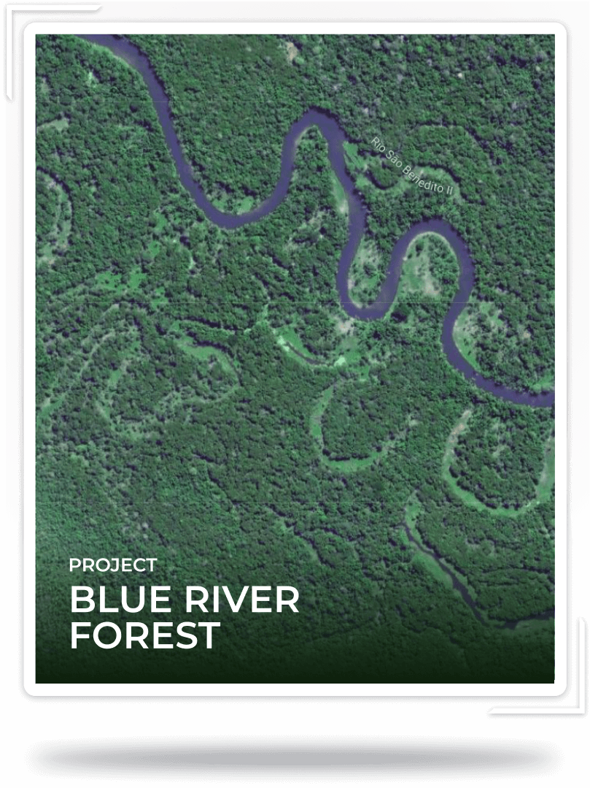

# Moss Amazon Forest Collection

我们是气候学家。
通过知识和区块链技术提供环境解决方案的全球领导者。我们将环境解决方案与区块链技术相结合，确保我们所做的一切事情的可追溯性和透明度。我们希望简化可持续性并使可持续性民主化，以便每个人都可以成为这一运动的一部分。巴西最大的区块链解决方案公司。
专注于通过区块链技术开发业务和定制产品，连接公司和个人，创造一个新的、更民主的全球经济。我们创建了一个为期 30 年的保护基金，将使用来自 NFT 的所有收入的 20% 来支付巡逻、卫星图像和该地区安全的任何其他必要需求的成本。

