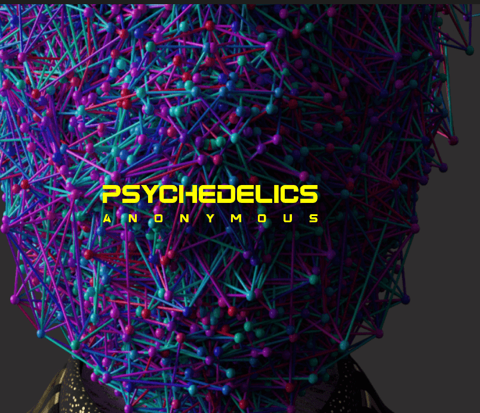
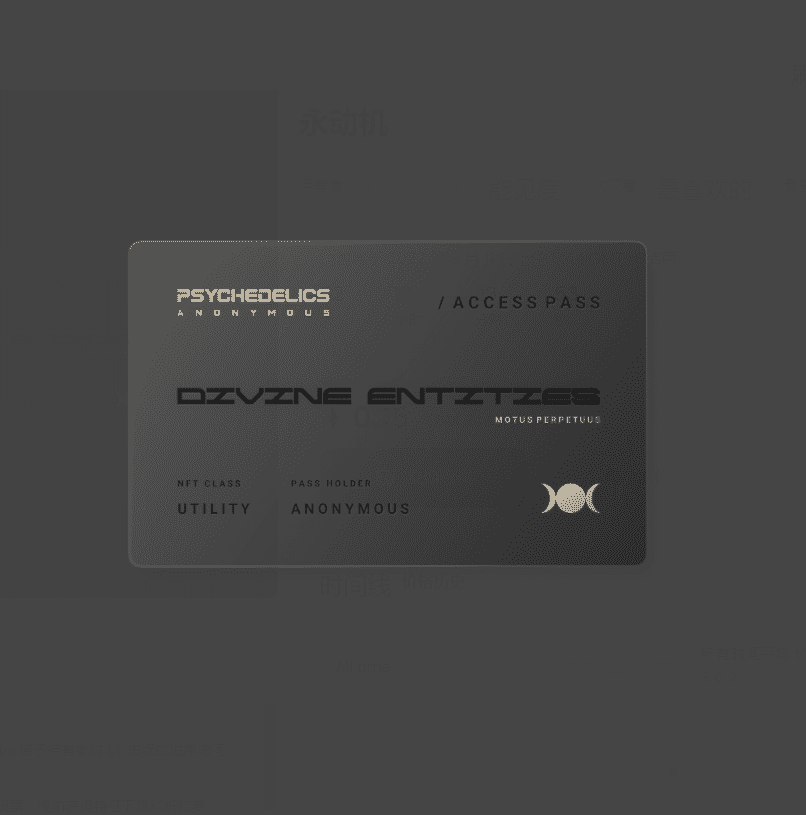

# Motus Perpetuus

**我们是黑夜**

在我们睡觉的日光之下，过往车辆的管弦乐雪崩和奴役系统的机械研磨让我们感到困扰和空虚。

当我们推拉时，我们像静电一样在拥挤的噪音中起起落落——我们阳光般的头脑不断地蒙上阴影。

寂静的日子陷入疲惫的几个月——存在的重复。只有黑夜的裹尸布才能提供救赎，黑色的毯子可以避免孤立的启示。

在零时，我们聚集在黑暗中寻找通往外部世界的内在路径——逃离我们发条生活的虚假梦想。我们在同步的小夜曲中像狼一样嚎叫，寻找机器——幽灵般的神殿。

我们正在醒来。

**好处包括：分配到奖励池、治理投票、提前获得特征下降和折扣费用。**

该 NFT 由 PSY 基金会创立和分发。

The Divine Entities 是一个市场，允许收藏家将他们启用 DE 的 ERC721 代币解构为其个人特征。收藏家可以在一个收藏中购买、出售、交换和装备不同的特征。
