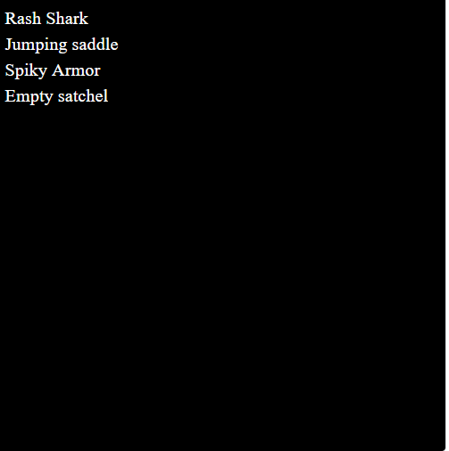

# Mounts for Adventurers

冒险家坐骑统计
创建于 12 个月前
450 代币供应
0% 费用
过去 7 天内没有售出冒险者坐骑。

为您的战利品冒险家随机生成的坐骑。不要赤脚：坐骑。
▶ 什么是冒险者坐骑？
Mounts for Adventurers 是一个 NFT（非同质代币）系列。存储在区块链上的数字艺术品集合。
▶ 冒险者坐骑代币有多少？
冒险家 NFT 总共有 450 个坐骑。目前，188 位拥有者的钱包中至少有一个冒险者 NTF 坐骑。
▶ 最近卖出了多少冒险者坐骑？
过去 30 天内共售出 0 个 Adventurers NFT 坐骑。

