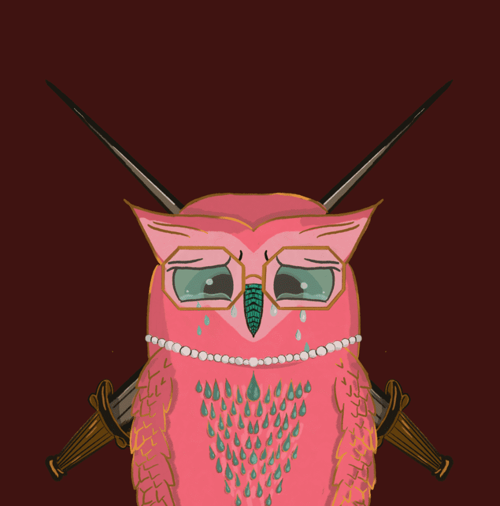
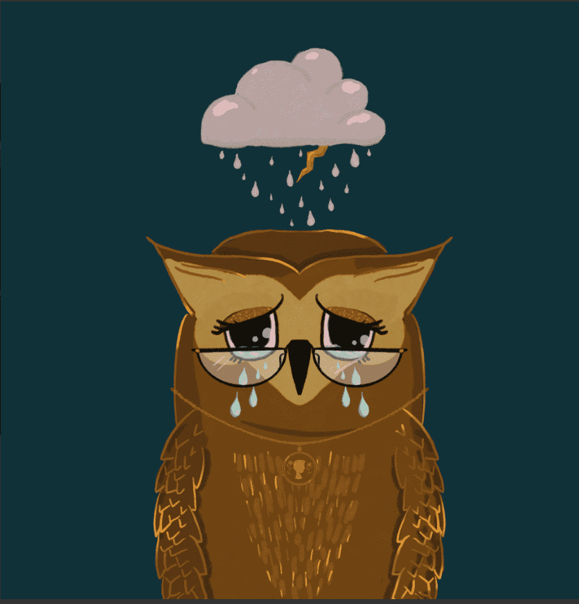

# Mournbirds

8 年前，我开始了我的书法创作之旅。我不仅通过这种艺术找到了自己的声音，而且我很幸运地为 Goop、Martha Stewart 和 Tiffany & Co 做书法工作。我什至有机会写一本关于[Copperplate Calligraphy]的指导书。

2021 年初，我了解了 NFT 技术，并被艺术家和收藏家的出处和所有权原则以及这项技术可以实现的未来所吸引。我开始将我的书法作品铸造为 NFT，并开始进行插图练习。我的目标是创作充满活力、色彩丰富的插图，并以诙谐的方式呈现当前的艺术和技术状态。

**截止至9月08日**

300项目

189拥有者

20.5总容积

0.05底价

0.03最好的报价

