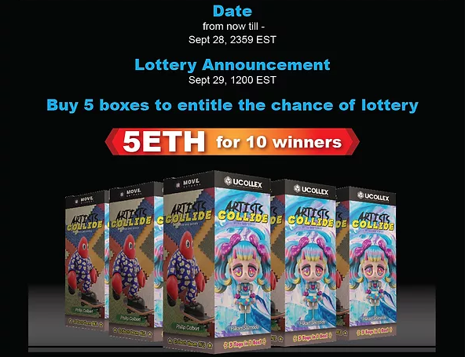

# ArtistsCollide

欢迎来到“艺术家碰撞”盲盒系列。

“ARTISTS COLLIDE”是 BLIND BOX 系列，包含 20,000 个带有 3D NFT 玩具收藏品的 3D NFT 玩具收藏品，由 5 位知名艺术家创作，包括：Hikari Shimoda、Philip Colbert、Takeru Amano、Pat Lee 和 Yasuhito Kawasaki。盲盒让您可以使用来自不同艺术家的独特和限量版 3D 上下摆动玩具。您可以以合理的价格购买一包。固定价格框架非常适合那些喜欢以更舒适的方式进行交易的人。社区可以通过 MOVE Network NFT Marketplace 解锁未来的领域和福利！Artists Collide 是一个由 Defi 驱动的 NFT 盲盒系列，通过奖励用户的参与和享受来赋予他们权力。

