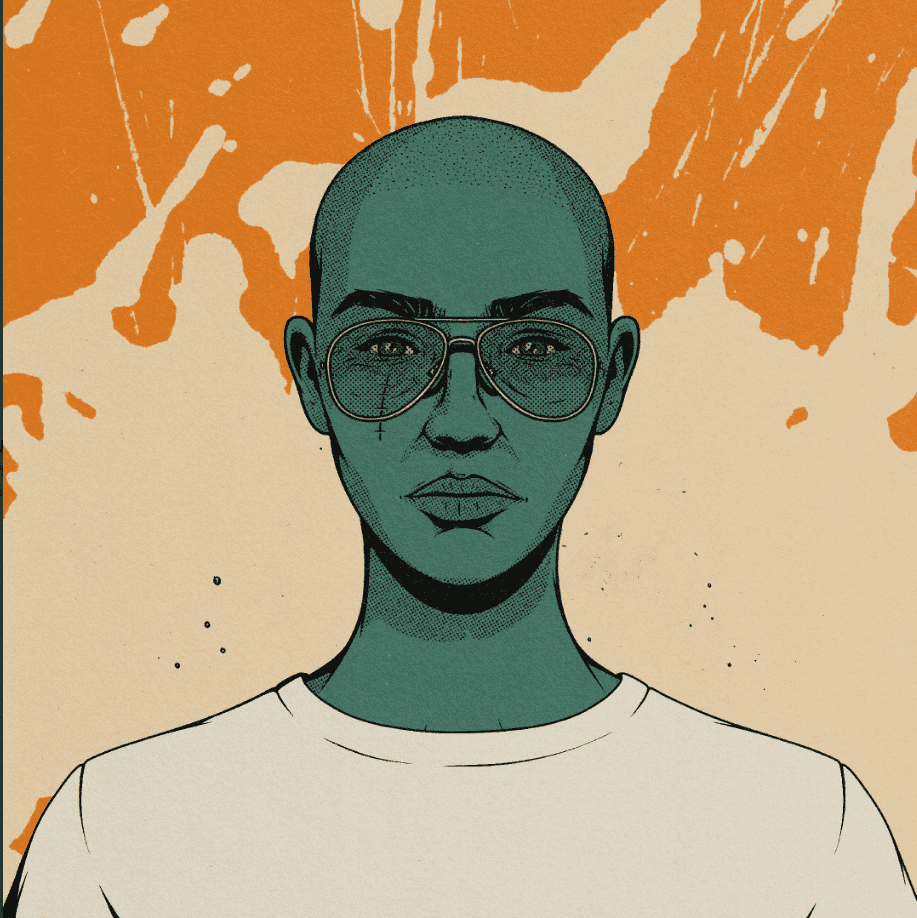
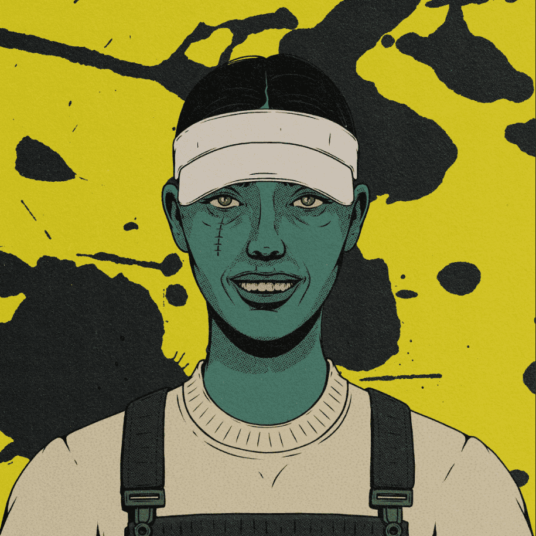

# MPL Official

**足球。归你所有。 在火星上玩过。**

现在是 2022 年，加弗教授正在火星上建立一个新的足球联赛。为什么？因为将他最喜欢的足球队出售给一个声名狼藉的新东家，实在是太让人失望了。

**什么是火星超级联赛？**

是生活在以太坊区块链上的 10,000 个独特的人类和火星角色的集合。这些角色是您进入火星超级联赛游戏的途径：这是一款“足球经理”风格的游戏，持有者可以在 MPL 联赛中训练、交易和竞争。随着时间的推移，这些创世角色将在第一款 MPL 游戏之外得到进一步的应用。

