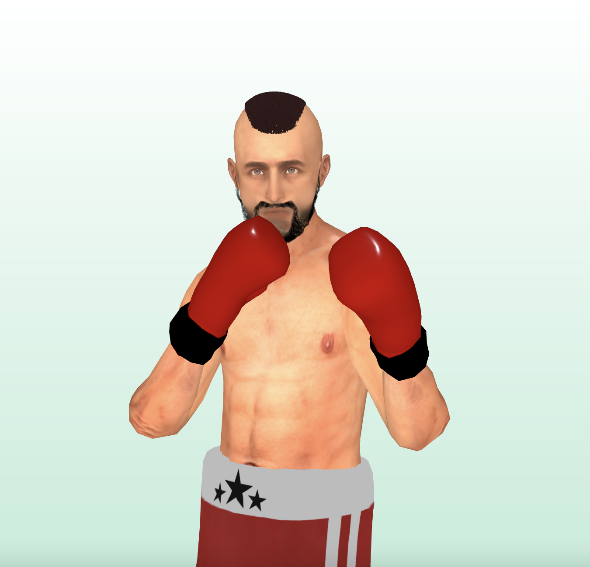

# MQ PUNCH

MQ punch 是乌克兰 P2E nft 格斗游戏，持有者将能够参加具有高奖池的锦标赛。

每个人都可以现场观看拳击比赛或重播。 加入我们的不和谐以了解更多信息。每个 nft 拳击手都有自己的体重类别、主要属性和基本数据（力量、敏捷性和耐力），可以在训练中心进行改进。

根据主属性，改进相应的特性会更有效率。 拳击手的统计数据越高，赢得战斗的机会就越大。

评级系统包含 4 个部门，具有独特的奖池。 - 青铜 - 银 - 金 - 铂金。 您可以通过参加比赛获得评分。

每 3 个月，每个部门的最佳球员都会从奖池中获得奖金。

