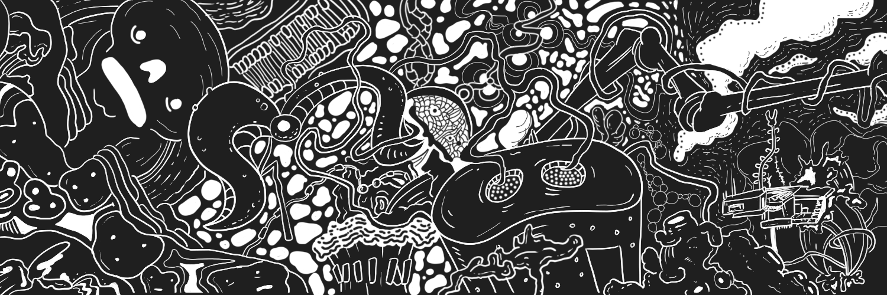

# Mr Jebus X Taconomics

Jebus 先生是一位喜欢制作人物插图的艺术家，从流行媒体到骷髅女士，从在地牢尽头爬行的怪物到可爱的肖像……混合和匹配不同的概念，创造出有趣和酷炫的作品。Jebus 先生是一位墨西哥艺术家，因此乍一看，与 Taconomics 合作的想法对他来说似乎很有趣。他从流行媒体中汲取灵感，然后添加了墨西哥卷饼的风味来创作这些令人难以置信的作品。

我们现在是通过以下方式成立的有限责任公司
@Otonomos

Taconomics LLC，我们正在迈向成为 DAO 的一些小步骤。

