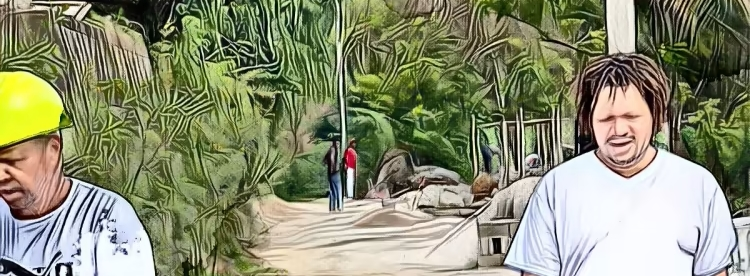

# Mr. Spencer

**Spencer NFT 先生 - 常见问题（FAQ）**
▶ 什么是斯宾塞先生？
Spencer 先生是一个 NFT（不可替代代币）集合。存储在区块链上的数字艺术品集合。
▶ 斯宾塞先生代币有多少？
总共有 53 个斯宾塞先生 NFT。目前 3 位所有者的钱包中至少有一个 Mr. Spencer NTF。
▶ Spencer 先生最昂贵的一次拍卖是什么？
Spencer 先生出售的最昂贵的 NFT 是 杰克锤屋顶。它于 2022-06-17（2 个月前）以 2000 美元的价格售出。
▶ 最近卖了多少斯宾塞先生？
过去 30 天内售出了 28 个斯宾塞先生 NFT。
▶ 斯宾塞先生的价格是多少？
过去 30 天，Spencer 先生 NFT 最便宜的销售额低于 1098 美元，最高销售额超过 1976 美元。过去 30 天，Spencer 先生 NFT 的中位价格为 1805 美元。
▶ 有哪些流行的 Mr. Spencer 替代品？
许多拥有 Mr. Spencer NFT 的用户还拥有 Carpenter IAN、 Miami Bella Bambina、 Rarible。

