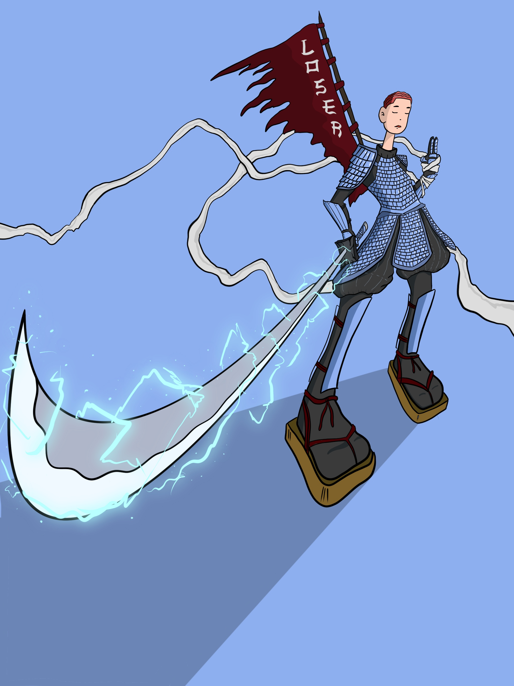

# mrboba draws losers

这个项目是由 Loser Club 的衍生灵感，由 MrBoba - Blessed by Loser Club 团队创建的。Loser Club 是艺术家 J'Von aka Catman aka Cool Sweater 和 The Four Hundreds 的一个项目。这是我对一些失败者的看法！查看实验室中的公告，了解我们最近几周所做工作的全部细节以及即将发生的事件顺序。 📆

代币准备好了！

##### ▶ 什么是 mrboba 画输家？

mrboba draws losters 是一个 NFT（非同质代币）集合。存储在区块链上的数字艺术品集合。

##### ▶ 有多少 mrboba 平局失败者代币？

总共有 25 个 mrboba 平局 NFT。目前 22 位所有者的钱包中至少有一个 mrboba 平局失败者 NTF。

##### ▶ 最近卖出了多少 mrboba 平局失败者？

在过去 30 天内售出 0 个 mrboba 平局失败 NFT。

