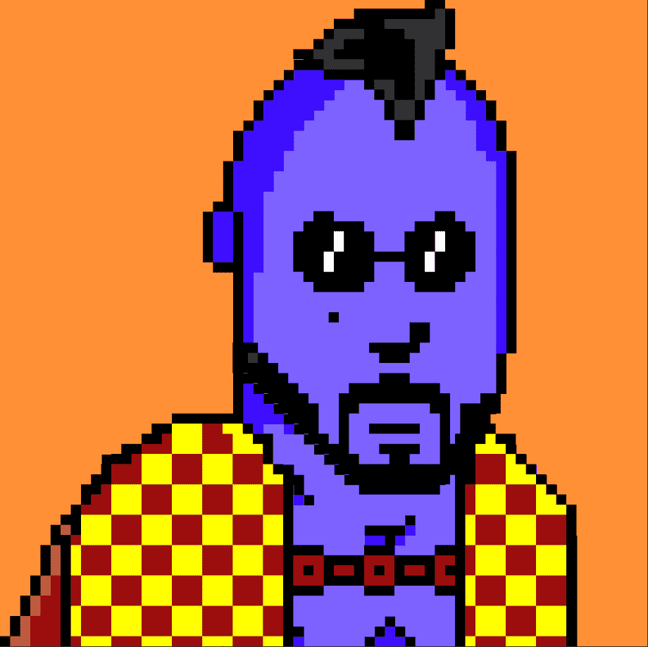

# MrFreeman

**Freeman 先生是一个 3340 NFT 集合。**

Freeman 先生的灵感来自于在中爪哇三宝垄 Terboyo 码头附近停车场工作的 Kang Bewok。

Kang Bewok 目前住在三宝垄市的 Ghozali 房子附近。Kang Bewok 说，感谢您的支持，并享受 Kang Bewok NFT 收藏的乐趣。

第 1 阶段：公开出售 3340 NFT（3133 生成和 207 唯一 1/1）

第 2 阶段：MrFreeman 玩赢游戏（2022 年中）

##### ▶ 什么是弗里曼先生？

MrFreeman 是一个 NFT（非同质代币）集合。存储在区块链上的数字艺术品集合。

##### ▶ 有多少 MrFreeman 代币？

总共有 2,401 个 MrFreeman NFT。目前 3 位所有者的钱包中至少有一个 MrFreeman NTF。

##### ▶ 最近卖出了多少 MrFreeman？

过去 30 天内售出 0 个 MrFreeman NFT。

