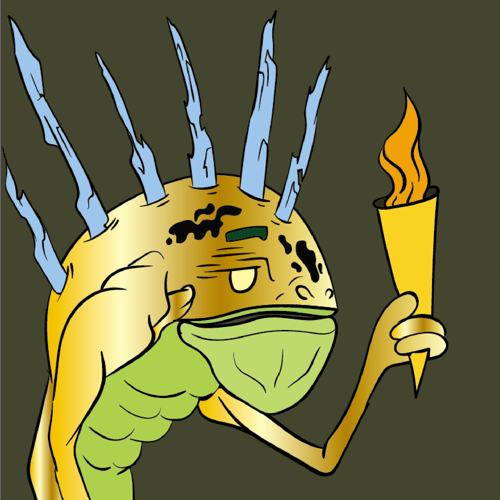

# MRGLIN

▶ 什么是 MRGLIN？
MRGLIN 是一个 NFT（不可替代代币）集合。存储在区块链上的数字艺术品集合。
▶ 有多少个 MRGLIN 代币？
总共有 2,222 个 MRGLIN NFT。目前，351 位所有者的钱包中至少有一个 MRGLIN NTF。
▶ 最昂贵的 MRGLIN 销售是什么？
售出的最昂贵的 MRGLIN NFT 是 mrgl mrgl #1064。它于 2022-06-09（3 个月前）以 88.4 美元的价格售出。
▶ 最近卖出了多少 MRGLIN？
过去 30 天内售出了 79 个 MRGLIN NFT。
▶ MRGLIN 的费用是多少？
在过去 30 天里，最便宜的 MRGLIN NFT 销售额低于 4 美元，最高销售额超过 14 美元。在过去 30 天内，MRGLIN NFT 的中位价格为 5 美元。
▶ 什么是流行的 MRGLIN 替代品？
许多拥有 MRGLIN NFT 的用户还拥有 EL NUMEROS、 DegenOkayBears、 WaterBe4nZuki和 Old Legacy。

