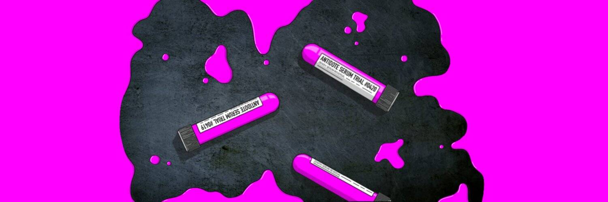

# MSC Antidote

**MSC Antidote NFT - 常见问题（FAQ）**
▶ 什么是 MSC 解毒剂？
MSC Antidote 是一个 NFT（不可替代令牌）集合。存储在区块链上的数字艺术品集合。
▶ 有多少个 MSC Antidote 代币？
总共有 1 个 MSC Antidote NFT。目前，4,699 位车主的钱包中至少有一个 MSC Antidote NTF。
▶ 最昂贵的 MSC Antidote 销售是什么？
出售的最昂贵的 MSC Antidote NFT 是 . 它于 2022 年 6 月 25 日（2 个月前）以 353.5 美元的价格售出。
▶ 最近卖出了多少 MSC Antidote？
过去 30 天内售出了 101 个 MSC Antidote NFT。
▶ MSC 解毒剂的价格是多少？
过去 30 天，MSC Antidote NFT 最便宜的销售额低于 21 美元，最高销售额超过 50 美元。过去 30 天 MSC Antidote NFT 的中位价格为 26 美元。
▶ 什么是流行的 MSC Antidote 替代品？
许多拥有 MSC Antidote NFT 的用户还拥有 Horse Town Club、 Founder Capsules、 This Is Your Brain On ETH和 Gutter Merch 2.0。

