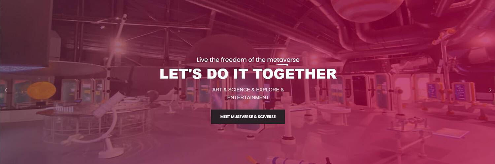

# MSCMetaverse VR Ticket

活出元宇宙的自由MSC元界；它是一个由 3D 交互模型组成的虚拟世界，配备了许多艺术品、历史建筑、科学展览、教育工作坊、旅游景点和游乐园。获取 Ticket-NFT 免费进入 MSCMetaverse 的 VR 艺术、历史博物馆和互动科学中心。只有10,000 个Ticket-NFT 将被铸造，新的访客会想从你这里购买。我们的目标是建立一个专注于 Web 3.0 机会的优质艺术、科学、教育、探索和娱乐社区。

▶ 什么是 MSCMetaverse Ticket NFT？
MSCMetaverse Ticket NFTs 是一个 NFT（Non-fungible token）集合。存储在区块链上的数字艺术品集合。
▶ MSCMetaverse Ticket NFTs 代币有多少？
总共有 18 个 MSCMetaverse Ticket NFTs NFTs。目前 6 位所有者的钱包中至少有一个 MSCMetaverse Ticket NFTs NTF。
▶ 最近卖出了多少 MSCMetaverse Ticket NFT？
过去 30 天内售出 0 个 MSCMetaverse Ticket NFTs NFTs。

