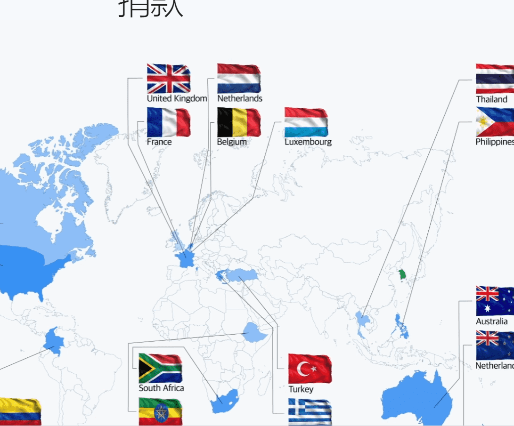

# MSD June NFT Project

**导弹防御 NFT (MSD) 是一个旨在提高人们对朝鲜持续导弹威胁和挑衅的认识的项目。**

基本上，这个项目是关于预测朝鲜将发射的导弹数量。如果有人正确预测了数字，则将向他/她支付所筹资金的金额，以换取对国家安全的持续关注。如果没有人预测导弹的数量，那么超过募集资金的金额将被拆分并分配给前 6 名 NFT 持有者。该项目的目的不仅在于对朝鲜的导弹威胁进行预警，还将其实际利润的10%捐赠出去，因此最终每个人都将成为捐赠的参与者。

**项目进展**

 1、预测下月朝鲜导弹发射次数，购买相应的NFT。

 2.当月开始时，NFT所有者之间的交易是可能的。

 3.根据截至当月最后一天24:00的朝鲜导弹实际发射次数，

(1) 导弹发射时 ：给购买发射次数的 NFT 所有者

NFT 销售额的 80% 作为股息支付。

(2)在不发射导弹的情况下：给当月NFT多的前6名

NFT 销售额的 80% 将按如下方式进行差异支付。

*第一名: 70% 第二名: 20% 第三名: 4.9% 第四名: 3% 第五名: 1.4% 第六名: 0.7%

 4、募集资金的10%用于捐赠项目，10%用于运营费用。
