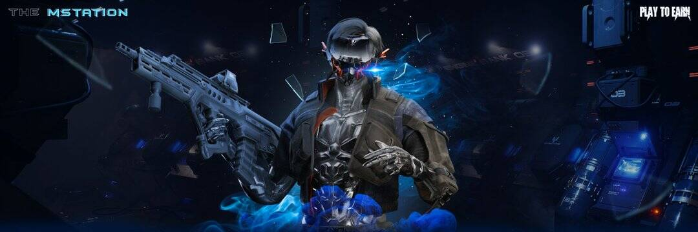

# MStation

MStation是币安智能链（BSC）上的第一款BSCS元界区块链游戏。玩家可以召唤角色、完成日常采矿任务、保护 MStation、掠夺稀有物品来玩和赚取。

在探索多元宇宙的旅程中，BSCS Spaceventures 发现了Bscdium 星球，而这个星球上最丰富的资源是bscdium。Spaceventures 决定安顿下来并建立一个 MStation 来开始开采稀有资源。这些资源是我们太空冒险漫长旅程的宝贵资源，我们将努力保护 MStation。直到有一天……在前往地球上最深的地牢之一的旅途中，我们意识到：我们并不孤单。现在是 BSCS Spaceventures 携带武器并反击以保护 MStation 的时候了。不管你是谁，来保护 MStation！

