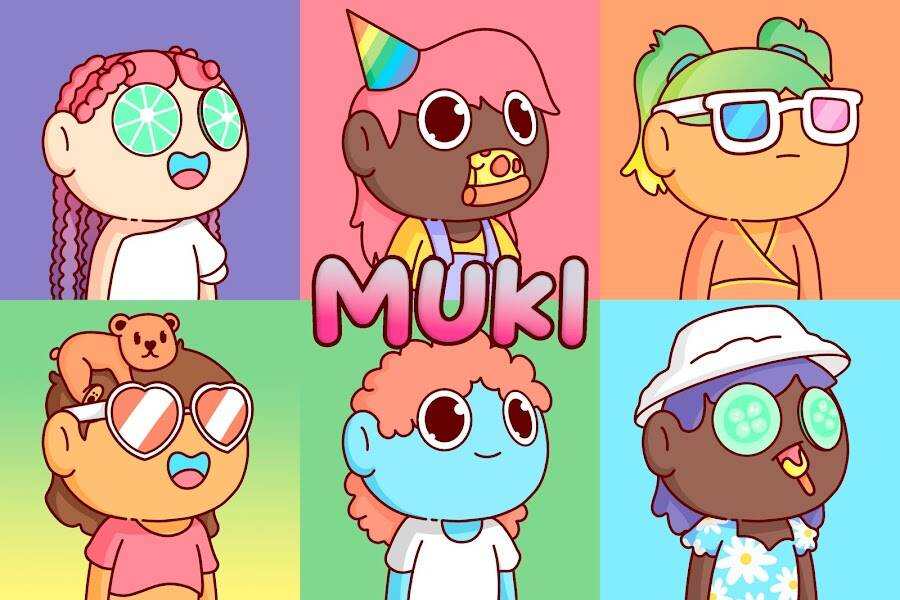

# Muki NFT

Muki NFT 统计
创建于 3 个月前
6,666 代币供应
10% 费用
过去 7 天内没有出售 Muki NFT。

Muki 是生活在以太坊区块链上的 6666 个多样化、美丽和独特的 NFT 的集合。

每个钱包免费领取 1 次，0.005ETH/NFT 之后。

每个 Wiggle 都是手绘的爱心劳动，需要数月的计划。Muki 让艺术爱好者拥有独一无二的艺术品，同时也让 NFT 空间更加多元化和包容。▶ 什么是 Muki NFT？
Muki NFT 是一个 NFT（不可替代代币）集合。存储在区块链上的数字艺术品集合。
▶ 有多少 Muki NFT 代币？
总共有 6,666 个 Muki NFT NFT。目前，2,828 位所有者的钱包中至少有一个 Muki NFT NTF。
▶ 最近卖出了多少 Muki NFT？
过去 30 天内售出了 575 个 Muki NFT NFT。
▶ Muki NFT 需要多少钱？
在过去 30 天内，最便宜的 Muki NFT NFT 销售额低于 3 美元，最高销售额超过 16 美元。过去 30 天内，Muki NFT NFT 的中位价格为 7 美元。

