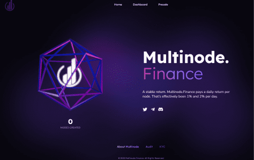

# Multinode.Finance

稳定的回报，Multinode.Finance 支付每个节点的每日回报，这实际上是每天 1% 到 2% 之间。

Multinode.Finance节点协议不仅仅是一个简单的单通证节点，而是一个因两个通证对而存在的节点，其中一个是普通的稳定币。因此，如果不通过 USDC 引入新资金，就无法铸造新节点。

除此之外，DAO 合约几乎拥有流通中的所有代币，因此不存在摇摆不定的可能性。还有我们的销售税限制倾销令牌。
