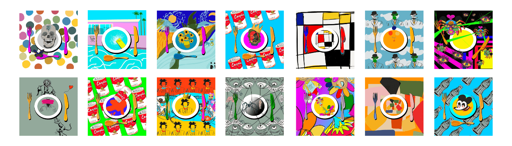

# MunchiesNFT Collection

5,000 种流行艺术菜肴的独特收藏

以 70 位传奇艺术家为灵感的实用工具。

在纽约时代广场和萨奇艺术画廊的其他艺术博览会上展出。MunchiesNFT 将传统艺术与数字艺术世界融合在一起。我们提供实体和数字作品。您还可以获得对您拥有的作品的完整知识产权。

我们的持有者可以访问高级工具，例如 MessariPro、DelphiDigital、IcyTools、交易技巧、早期访问加密货币等等。

我们受到艾未未、Alma W. Thomas、Ali Sabet、Andy Warhol、Banksy、Beeple、Damien Hirst、David Hockney、David Shrigley、Esther Mahlangu、Keiichi Tanaami、Pablo Picasso、Jean-Michel Basquiat 启发的一些艺术家、村上隆、文森特·梵高、XCOPY 和草间弥生。

有关更多信息，请关注我们的社交并加入我们的 Discord。

