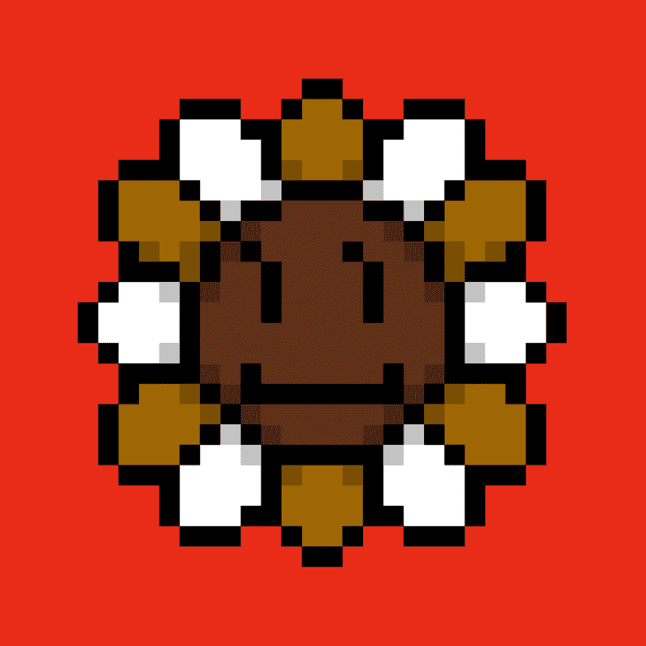

# Murakami.Flowers Official

**Murakami.Flowers 是艺术家村上隆的代表作品——花卉**

以点状艺术的形式表现出来，让人想起 1970 年代创作的日本电视游戏。该作品正在以数字108为关键词进行开发；108个背景和花色组合构成一个字段，有108个字段。每个字段有 108 个花卉图像，总共有 11,664 个花卉图像。数字 108 指的是 bonnō 或世俗的诱惑

**白名单将主要由 RTFKT 的 Clone X with Murakami Drip 的持有者组成，其中有 3,000 名。**

此外，还将有与村上有关的 500 人白名单，以及朋友和家人。我计划为白名单和朋友和家人一起预留 4,000 个。（白名单和朋友与家人分发后无人认领的数量将通过公开销售提供。）
随后将通过公开销售提供 6,751，这将是一个抽奖。
然后是幸运727证明，727是村上隆的幸运数字。之后，禅数证明有78个，而Bonnō证明有108个地球诱惑的数量。我打算在时机成熟的时候发布最后两个。

每个 MetaMask 钱包限购一朵花。在发布时，每一个都将作为“种子”分发，在公开发售后的 Reveal 时可以进化成（兑换为）一朵花。在揭示之前，不知道您的种子会变成 11,664 朵单独手工生成的花朵中的哪一种。

售价
白名单预售：0.0727 ETH
公开发售：0.108 ETH

