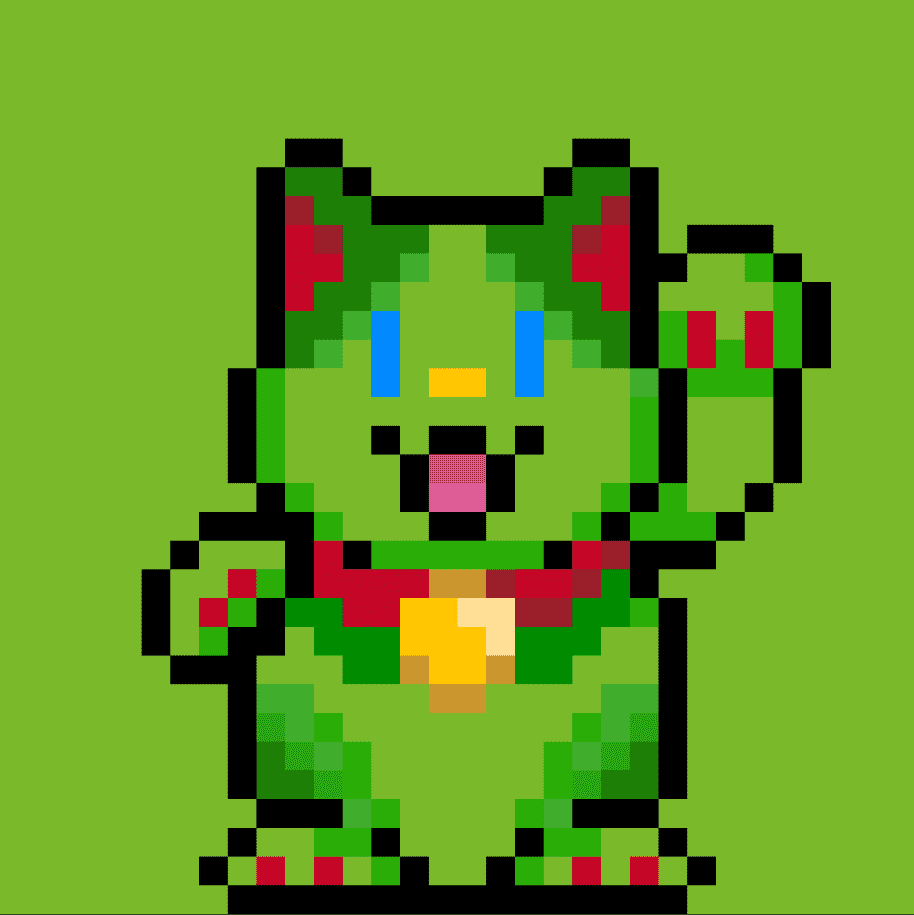
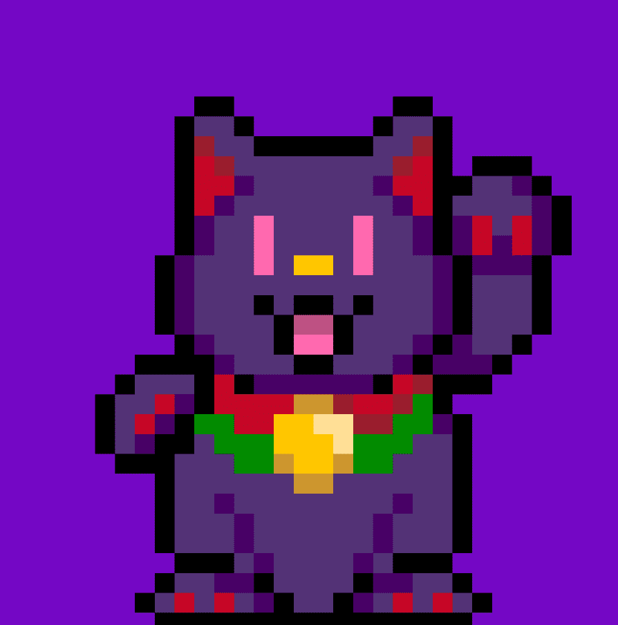

# Murakami Lucky Cat Coin Bank

**愿景和价值观**

Murakami.Flowers（以下简称MF）是基于艺术家村上隆于2000年提出的超扁平理论而被激活的。超扁平是指日本在太平洋战争压倒性战败后的77年中产生的文化概念。这个概念与流行音乐相反。超扁平指的是败者对社会建构的审美观念：日本在战后文化结构中无法建立由胜利者定义社会正义的结构，而是建立了反金字塔的等级制度。日本漫画、动漫和“轻小说”叙事形成的根源在于这种看似消极的感觉，即永远无法完全支持获胜者。然而，
这就是为什么在这幅作品中散布着许多日本图像的原因。
失败者也有他们的论点，也有他们对美的看法。我希望在这个项目中形象化这样的景观。

**生态系统**

艺术界是一个完全不同于股票和商品的生态系统。它是一个拥有巨大规模的文化综合体和市场。由于它已经在交易 NFT 艺术，并以类似 DAO 的世界观运作，我相信 M.F 的使命是将其与居住在 NFT 和 DAO 世界的人们联系起来。
