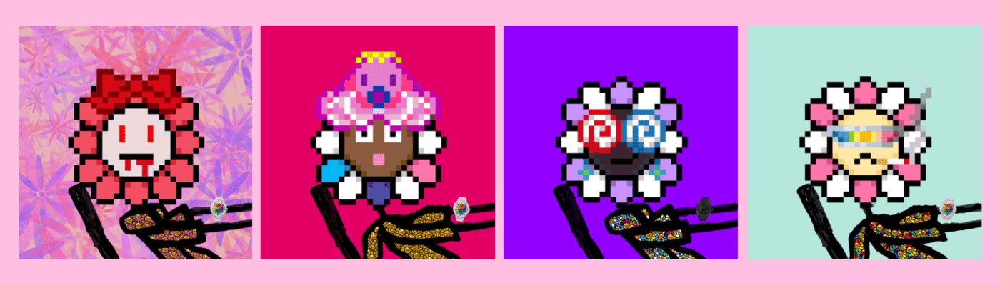

# Murakami Mfers V2

**前 3500 免费！** 之后每个
0.0069
20 个交易限制

murakami mfers 完全由 Murakami King 的手绘生成。该项目属于公共领域；随意使用 murakami mfers 以任何你想要的方式。▶ 什么是村上 Mfers V2？

Murakami Mfers V2 是一个 NFT（Non-fungible token）集合。存储在区块链上的数字艺术品集合。

##### ▶ 有多少 Murakami Mfers V2 代币？

总共有 3,522 个 Murakami Mfers V2 NFT。目前，210 位车主的钱包中至少有一个 Murakami Mfers V2 NTF。

##### ▶ 最近卖出了多少 Murakami Mfers V2？

过去 30 天内售出 0 个 Murakami Mfers V2 NFT。

