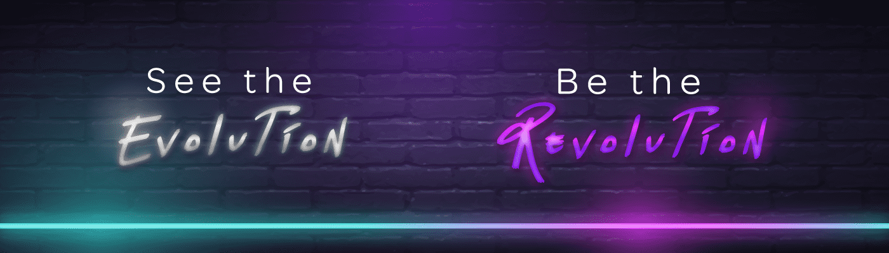

# MurAll

什么是 MurAll？
MurAll 是一个协作画布，允许世界各地的艺术家在不断发展的艺术作品上作画。这是通过使用区块链技术实现的同类项目中的第一个。MurAll 需要一个名为 PAINT 的数字令牌，以使艺术家能够在画布上绘画。每个 PAINT 令牌可以绘制 2 个像素，就像现实生活中的油漆一样，它只能用于绘制一次。如果已使用，则不能从墙上取下并重复使用！全球可用的 PAINT 数量有限（只有足够的 PAINT 足以覆盖画布 21,000 次），它是一种商品，可以鼓励艺术家创作他们热衷的作品，因为使用的 PAINT 越多，可用的 PAINT 就越少。一旦艺术家创作了他们的作品并在 MurAll 画布上“铸造”了它，它就会在区块链上永垂不朽。艺术家收到其绘画的 NFT（不可替代令牌）；与传统代币相比，NFT 是其中的一种，确保艺术品是独一无二的原件，具有价值并且可以随时保存或出售——就像现实生活中的画作一样。与大多数现有技术不同，艺术品本身包含在令牌中，而不仅仅是证书。

