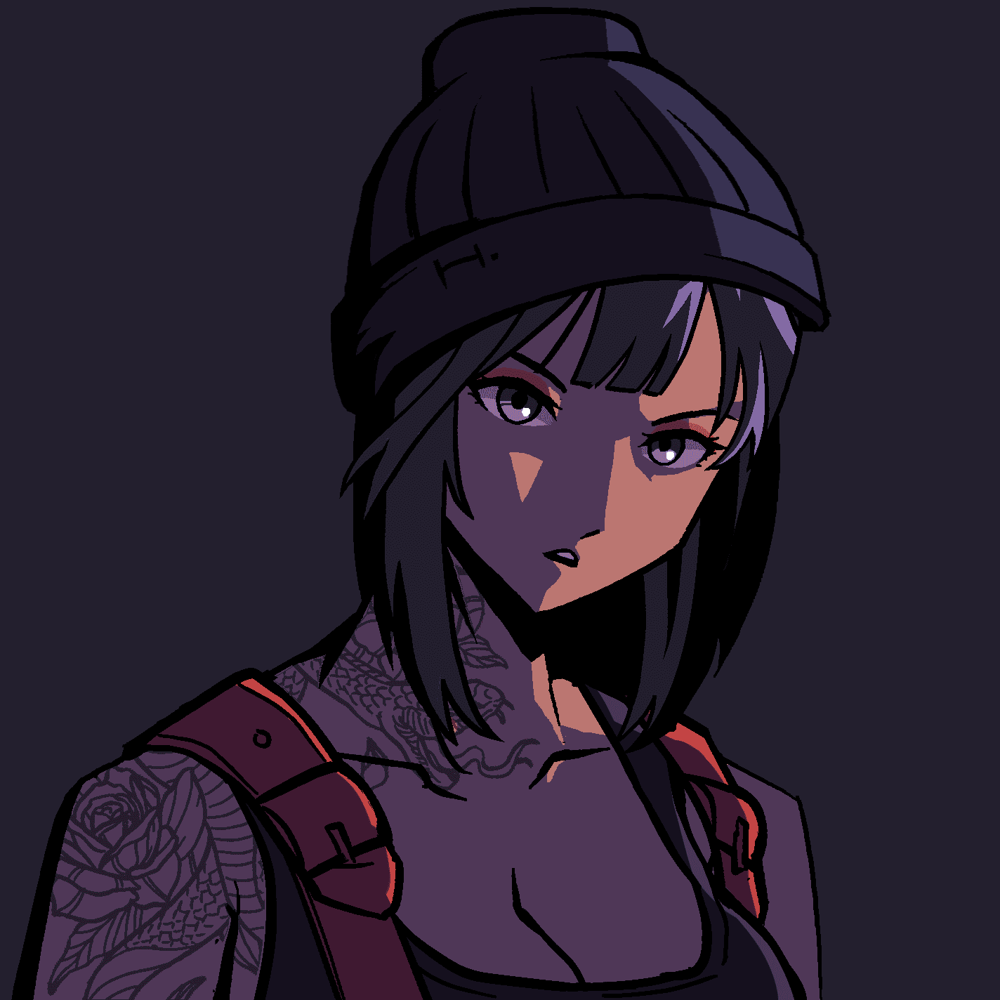

# MURI

首先，我们要感谢我们的社区以及迄今为止支持 MURI 并真正相信我们所实现和所做的每一位成员和追随者。本文是关于 MURI 的路线图，如果您还没有查看过一般文章，我们很想听听您对此的反馈！考虑到围绕元宇宙构建我们自己的生态系统的想法，我们计划发布一个由 MURI 持有者获得的代币。我们计划以任何方式整合它，作为一种货币来购买更多的商品，例如实体物品，或者为未来计划的东西提供游戏内的货币。Launching the Token is planned in Q1.正如被戏弄的那样，我们将围绕 MURI 的故事和她的未来发布一整部动画。这包括整个路线图，当动画中发生更改时，它将更新更改中包含的每个角色，元数据包含在那里。
我们将发布动画版和印刷版，planned to come between Q1 and Q2.考虑到结合物理和虚拟的想法，我们的想法是发布在故事中扮演主要角色的每个 MURI 角色的高质量模型。这些人偶将少量供应，全部以最好的方式手工制作和生产。我们的目标是发布一个full version in Q3 / Q4.

