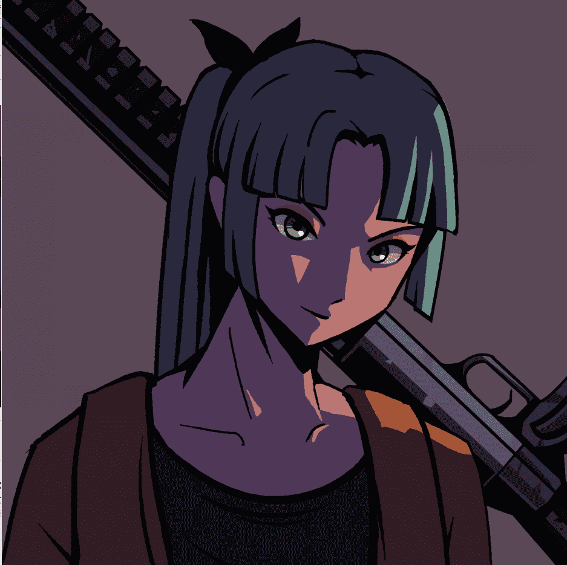
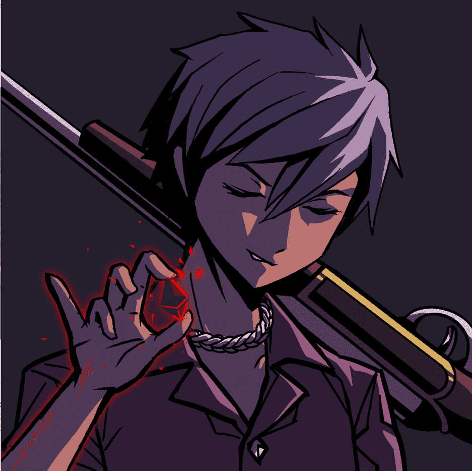

# MURI by Haus

**穆里的象征**

考虑到围绕元宇宙构建我们自己的生态系统的想法，我们计划发布一个由MURI持有者获得的代币。我们计划以任何方式整合它，作为一种货币来购买更多的商品，例如实体物品，或者为未来计划的东西提供游戏内的货币。计划在第一季度推出代币。

**穆里动漫**

正如被戏弄的那样,我们将围绕MURI的故事和她的未来发布—整部动画。这包括整个路线图，当动画中发生更改时，它将更新更改中包含的每个角色，元数据包含在那里。

我们将发布动画版和印刷版，计划在第一季度和第二季度之间发布。

**穆里物理玩具**

考虑到结合物理和虚拟的想法，我们的想法是发布在故事中扮演主要角色的每个MURI角色的高质量模型。这些人偶将少量供应，全部以最好的方式手工制作和生产。我们的目标是在第三季度/第四季度发布完整版本。

**时尚系列**

由于我们的团队很早就进入了时尚界,我们希望将所有元素结合起来,形成商品,而不仅仅是这些。虽然我们将为MURI提供我们自己的商品，但我们也将提供实体工艺系列。我们创建的每个化身都将具有可制作的特征，持有者可以兑换和制作它的物理版本。部分零件将在第一季度交付。

