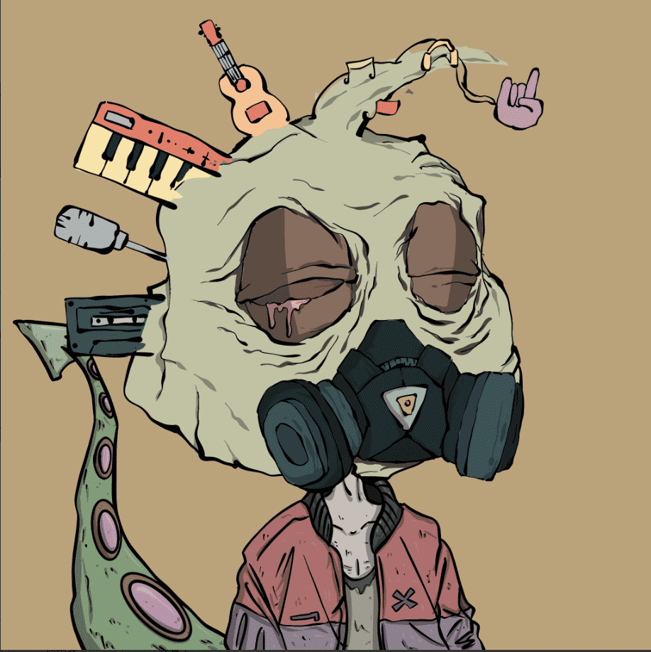
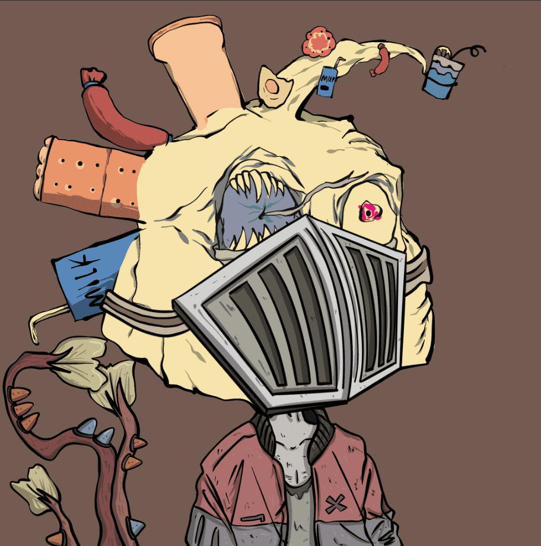

# murloctown

**鱼人镇**

每个人都有1他妈的免费薄荷

0.0069 Ξ 每个

每个钱包10 分钟

别他妈的贪心！

##### ▶ 什么是鱼人镇？

murloctown 是一个 NFT（非同质代币）集合。存储在区块链上的数字艺术品集合。

##### ▶ 有多少鱼人镇代币？

总共有 10,000 个鱼人镇 NFT。目前，3,649 位所有者的钱包中至少有一个鱼人镇 NTF。

##### ▶ 鱼人镇最昂贵的交易是什么？

出售的最昂贵的鱼人镇 NFT 是 鱼人镇 #5934。它于 2022-06-12（3 个月前）以 11.7 美元的价格售出。

##### ▶ 最近卖了多少鱼人镇？

过去 30 天内共售出 12 个鱼人镇 NFT。

##### ▶ 一个鱼人镇要多少钱？

在过去 30 天里，鱼人镇 NFT 最便宜的销售额低于 0 美元，最高销售额超过 10 美元。过去 30 天内，鱼人镇 NFT 的中位价格为 0 美元。

