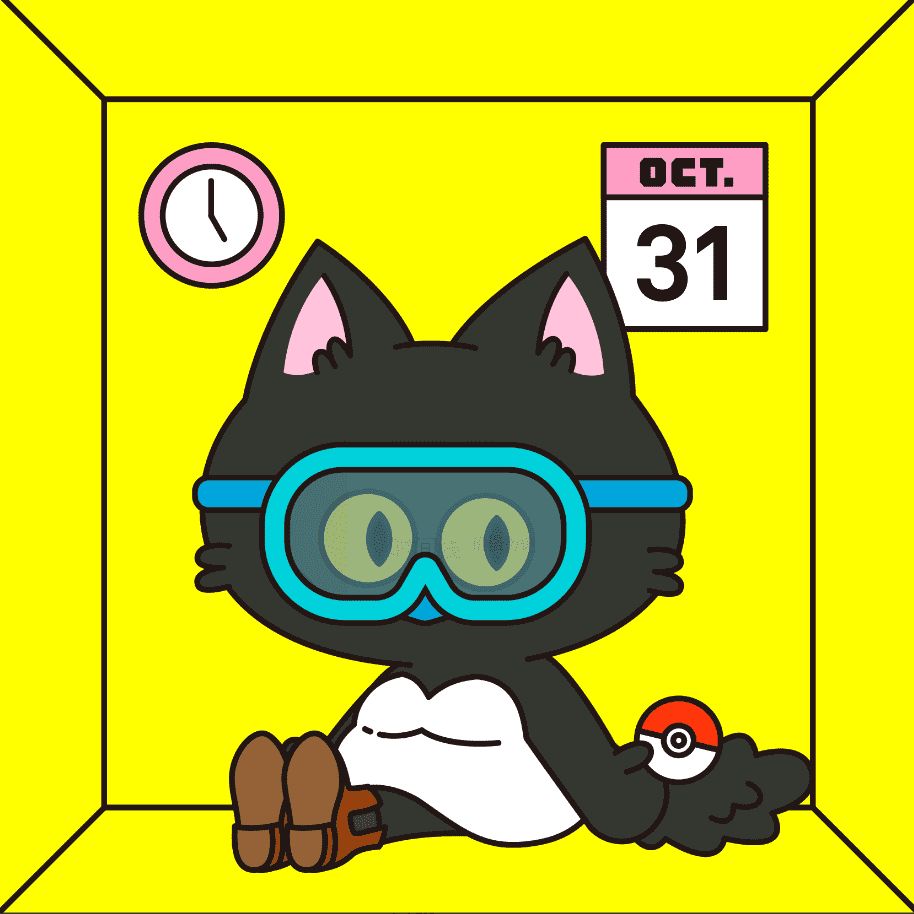
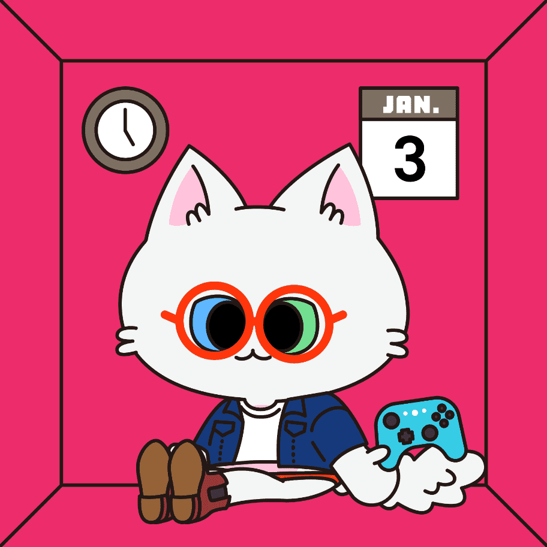

# MurMur Cats

**最互助的区块链知识学院，陪你一起呢喃，一起成长。**

**呢喃猫限量999只，快点加入我们喵**

**呢喃猫白名单公告**

- Mint 价格1.8 ETH，请在钱包准备1.8 ETH跟需要的GAS(0.05应该就足够)。
- Mint 时间到3/6(日) 12：00，但建议在3/5(六) 21：00完成，已参加3/5晚上的迎新活动。
- Mint 完成后，在OpenSea上就可以看到盲盒啰。
- Mint 有任何问题请在DC @管理员，或是至#英雄猫猫地址提交联络管理员。

##### ▶ 什么是 MurMur 猫？

MurMur Cats 是一个 NFT（非同质代币）集合。存储在区块链上的数字艺术品集合。

##### ▶ 有多少 MurMur Cats 代币？

总共有 759 个 MurMur Cats NFT。目前，460 位业主的钱包中至少有一个 MurMur Cats NTF。

##### ▶ 什么是最昂贵的 MurMur Cats 销售？

出售的最昂贵的 MurMur Cats NFT 是 MurMur Cat #227。它于 2022 年 6 月 9 日（3 个月前）以 4.6 万美元的价格售出。

##### ▶ 最近卖出了多少只 MurMur 猫？

过去 30 天内售出了 23 个 MurMur Cats NFT。

##### ▶ 一只 MurMur 猫要多少钱？

在过去 30 天里，最便宜的 MurMur Cats NFT 销售额低于 2762 美元，最高销售额超过 4527 美元。过去 30 天，MurMur Cats NFT 的中位价格为 3122 美元。

