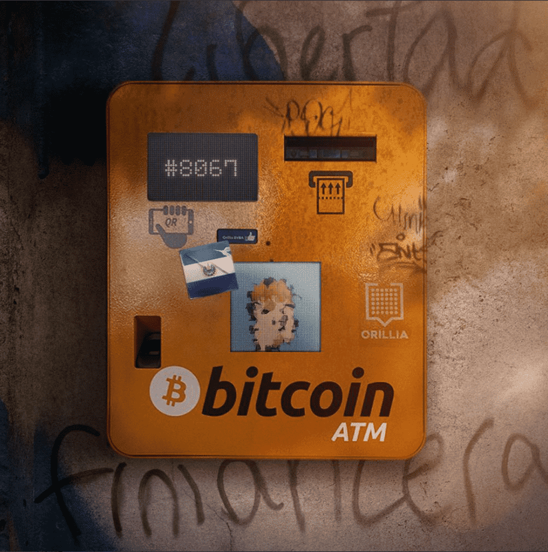
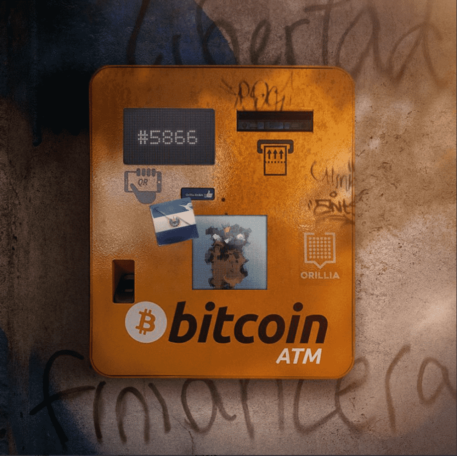

# Museum - The White Room

博物馆是一个生成 NFT 项目，它揭示了 NFT 艺术的历史、艺术和文化意义。每一件独特的作品都将不断演变成与庆祝日历日相匹配的身份。限量 4,801

**艺术精致**

博物馆是一个生成 NFT 项目，它揭示了 NFT 艺术的历史、艺术和文化意义。 

每一件独特的作品都将不断演变成与庆祝日历日相匹配的身份。正如人们在圣诞节前夕穿上周日最好的衣服，或者在 4 月 20 日在公园参加派对一样，NFT 也会根据加密世界庆祝的具有里程碑意义的日子而改变。 

你的艺术，你的历史日历。 

**什么是博物馆？**

博物馆是独特的生成 NFT 艺术项目，旨在捕捉我们历史的不同时刻。每个独特的 NFT 都会根据日历年的特定日期更改身份（48 小时）。切换时间将在格林威治标准时间上午 12 点确定。

**变形如何工作？**

为了确定我们是否处于“假期”，合约采用当前时间并进行一些数学运算来确定前一个午夜 GMT。因此，今天在格林威治标准时间上午 10 点输入将为您提供 10 小时前的时间。然后它检查假期列表以查看是否有任何假期应该在那个时候开始。如果不是，则从该时间减去 24 小时以检查前一天，因为每个假期将持续 48 小时。如果假日确实存在，那么它会获取包含该特定假日的艺术作品的 URI。如果不存在，则它使用仅显示默认艺术品的默认 URI。

我们将在我们的网站上有一个连接钱包页面，您将可以在切换时查看您的博物馆作品。话虽如此，由于 opensea 在内部存储数据，我们创建了一个脚本来自动 ping 它们以刷新元数据。由于它的操作系统和他们做操作系统的事情，这可能不是即时的。如果操作系统无法处理他们的狗屎，你可能需要在你的最后硬刷新。

**铸币多少钱？**

0.04ETH + 天然气。仅限钻石手
