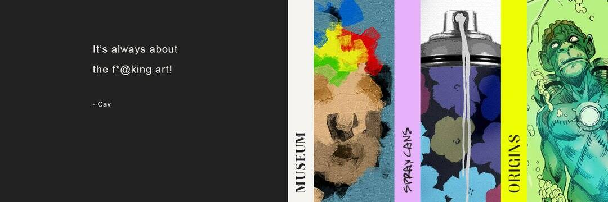

# Museum - The White Room

Museum - The White Room是一个生成 NFT 项目，它揭示了 NFT 艺术的历史、艺术和文化意义。

每一件独特的作品都将不断演变成与庆祝日历日相匹配的身份。正如人们在圣诞节前夕穿上最好的周日，或者在 4 月 20 日在公园参加派对一样，NFT 也会根据加密世界庆祝的具有里程碑意义的日子而改变。

你的艺术，你的历史日历。

