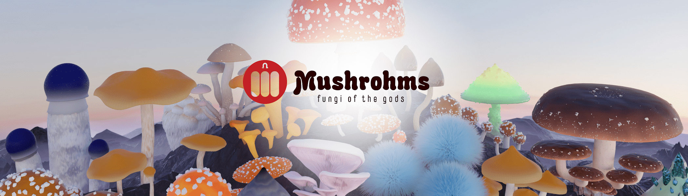

# MUSHROHMS: Descendants

蘑菇菌释放了它们的孢子！

Mushrohms: Descendants 是 Mushrohms 系列的最新成员，由普罗米修斯和哈迪斯孢子滴诞生。

普罗米修斯孢子滴在奥林匹斯山上释放了炽热的洞察力，而冥王孢子则从冥界带来了远方的智慧！

Mushrohm 菌丝网络正在快速增长。加入运动，成为 Shrohmie 并参与今天 Mushrohms 的未来！在奥林匹斯山的山顶上生长着众神的真菌：蘑菇 在无限的幸福中冥想，这些开悟的生物有一天会从山顶下山，改变这个世界和其他世界的意识！通过成为 Shrohmie 并参与未来的 Mushrohm 活动，如跨链孢子滴、合作、社区 POAP 等，加入运动！更新：所有 1st Gen Mushrohm 很快就能进入 Arbitrum 网络的可逆嬗变桥。在 Arbitrum，您将拥有相同的像素形式的 Mushrohm，并且将能够在 Mothershrohm 参与 TreasureDAO 生态系统。即将在 Trove Marketplace 上市。

