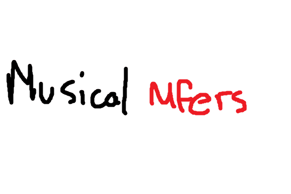

# Musical Mfers

音乐MFERS！
音乐MFERS是一个生活在以太坊区块链上的MFERS衍生项目

每个音乐MFER呈现为MP4，30 fps，1000 PX X 1000 PX，并包含一个随机节拍！

第一个420 Mustric Mfers免费！（10 x交易！）

薄荷1-4：价格0.015 ETH每NFT（+汽油费）

薄荷5-50：价格0.01 ETH每NFT（+汽油费，50 x交易！）关于该项目
没有路线图，没有不和谐，没有什么。遵循Sartoshi的意识形态：

“我所设想的 mfer 世界将集中体现“我们都是 mfers”这一简单理念。没有国王、统治者或明确的路线图——mfer 可以用这些 mfer 构建他们能想到的任何东西。”

您可以根据需要使用音乐 mfers（音频和视频）。没有版权 BS。

