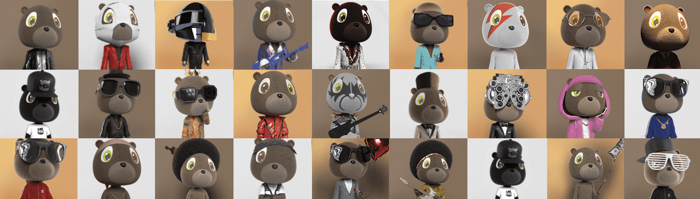

# Music Bear Awards | MBA

音乐熊奖 | 工商管理硕士统计
创建于 5 个月前
387代币供应
10% 费用
没有音乐熊奖 | MBA 在过去 7 天内售出。

Music Bear Awards (MBA) 是一个社区驱动的 Web 3.0 和 NFT 平台，它将通过为音乐爱好者和 NFT 爱好者提供一个空间来决定 MUSIC 的未来，从而分散音乐产业。

MBA 从 3664 只受标志性音乐时刻启发的涂料熊系列开始，所有这些都在 MBAverse 中产生共鸣……

除了非常酷之外，这个 NFT 还将授予 MBA 持有者访问疯狂的实用程序的权限，例如被动收入、The Ensemble 音乐读书俱乐部会员资格、独家音乐体验访问权限、Merch drop 等等。

合奏！我们是一个运动！

