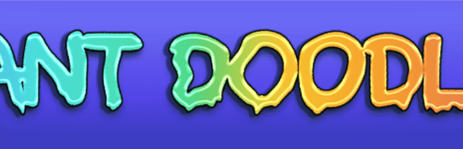

# Mutant Doodles Collection

10,000 个独特的突变体涂鸦系列

Mutant Doodles 是一个 NFT 衍生系列，由绝对喜欢 Doodles 的粉丝制作。他对猿有突变体而涂鸦没有这一事实感到不满。向伟大的致敬

*艺术受到启发，但与 Doodles 无关

突变涂鸦（官方）NFT - 常见问题（FAQ）
▶ 什么是突变涂鸦（官方）？
Mutant Doodles（官方）是一个 NFT（非同质代币）集合。存储在区块链上的数字艺术品集合。
▶ 有多少个 Mutant Doodles（官方）代币？
总共有 5,658 个 Mutant Doodles（官方）NFT。目前，1,744 位所有者的钱包中至少有一张 Mutant Doodles（官方）NTF。
▶ 什么是最昂贵的 Mutant Doodles（官方）销售？
出售的最昂贵的 Mutant Doodles（官方）NFT 是 Mutant Doodle #4245。它于 2022 年 6 月 22 日（2 个月前）以 5.5 美元的价格售出。
▶ 最近卖出了多少突变体涂鸦（官方）？
过去 30 天内售出了 19 个 Mutant Doodles（官方）NFT。
▶ Mutant Doodles（官方）要多少钱？
过去 30 天，最便宜的 Mutant Doodles（官方）NFT 销售额低于 0 美元，最高销售额超过 5 美元。过去 30 天内，Mutant Doodles（官方）NFT 的中位价格为 5 美元。
▶ 什么是流行的 Mutant Doodles（官方）替代品？
许多拥有 Mutant Doodles（官方）NFT 的用户还拥有 Cool Cats Expansion、 Gator-Raid Official、 PhantaDoodles和 Blu DeTiger X Budweiser Royalty。

