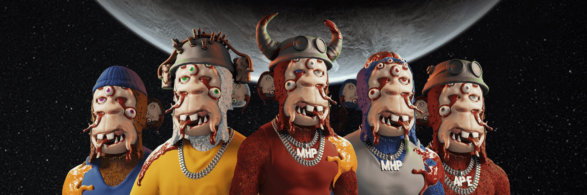

# MUTANT HAPE PRIME | OFFICIAL

Mutant Hape Prime (MHP) 是由 HAPE 和 BAYC 持有者创建的 8,888 个独特的 Mutated Hape 的独特集合。

突变HAPE PRIME | 官方 NFT - 常见问题（FAQ）
▶ 什么是突变HAPE PRIME | 官方的？
突变HAPE PRIME | OFFICIAL 是一个 NFT（非同质代币）集合。存储在区块链上的数字艺术品集合。
▶ 多少突变HAPE PRIME | 官方代币存在吗？
总共有 20 个 MUTANT HAPE PRIME | 官方 NFT。目前 11 位车主至少拥有一台 MUTANT HAPE PRIME | 官方 NTF 在他们的钱包里。
▶ 多少突变HAPE PRIME | 官方最近被卖了？
有 0 个突变 HAPE PRIME | 过去 30 天内售出的官方 NFT。

