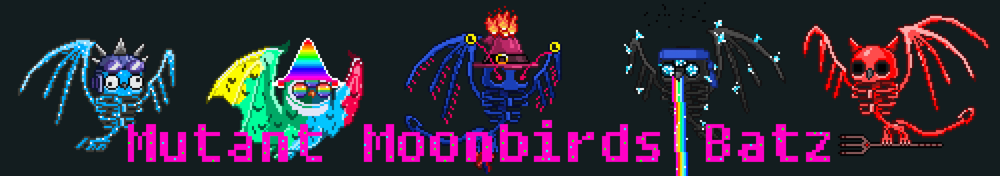

# Mutant MoonbirdsBatz

Mutant MoonbirdsBatz NFT - 常见问题（FAQ）
▶ 什么是 Mutant MoonbirdsBatz？
Mutant MoonbirdsBatz 是一个 NFT（非同质代币）集合。存储在区块链上的数字艺术品集合。
▶ 有多少 Mutant MoonbirdsBatz 代币？
总共有 1,000 个 Mutant MoonbirdsBatz NFT。目前，226 位所有者的钱包中至少有一个 Mutant MoonbirdsBatz NTF。
▶ 最近卖出了多少 Mutant MoonbirdsBatz？
过去 30 天内售出 0 个 Mutant MoonbirdsBatz NFT。
▶ 什么是流行的 Mutant MoonbirdsBatz 替代品？
许多拥有 Mutant MoonbirdsBatz NFT 的用户还拥有 MoonbirdsBatz、 dookieZuki.wtf、 mutantgoblinape和 Bored Ape Pixel Club v2。

