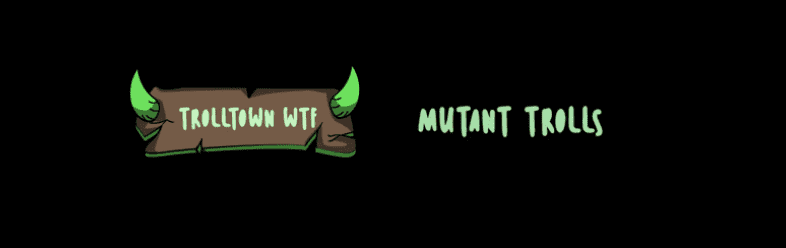

# Mutant Trolls by Trolltown

Trolltown Mutational Elixirs NFT - 常见问题（FAQ）
▶ 什么是巨魔镇突变药剂？
Trolltown Mutational Elixirs 是一个 NFT（不可替代令牌）集合。存储在区块链上的数字艺术品集合。
▶ 存在多少 Trolltown 突变药剂代币？
总共有 2 个 Trolltown Mutational Elixirs NFT。目前，994 位所有者的钱包中至少有一个 Trolltown Mutational Elixirs NTF。
▶ Trolltown Mutational Elixirs 最昂贵的交易是什么？
出售的最昂贵的 Trolltown Mutational Elixirs NFT 是 Trolltown Tier 1 Elixir。它于 2022-06-25（2 个月前）以 269.6 美元的价格售出。
▶ 最近卖出了多少 Trolltown 变异药剂？
过去 30 天内售出了 643 个 Trolltown Mutational Elixirs NFT。
▶ Trolltown 突变药剂的价格是多少？
在过去 30 天里，最便宜的 Trolltown Mutational Elixirs NFT 销售额低于 29 美元，最高销售额超过 104 美元。在过去 30 天内，Trolltown Mutational Elixirs NFT 的中位价格为 61 美元。
▶ 什么是流行的 Trolltown Mutational Elixirs 替代品？
许多拥有 Trolltown Mutational Elixirs NFT 的用户还拥有 troll-town.wtf、 mutantgoblinape、 LeprechaunTown_WTF和 hoboland.wtf。

