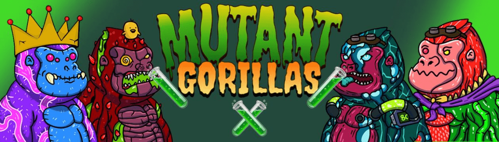

# Mutant Gorillas*

9000 只大猩猩因以太坊区块链上的疾病而发生变异。每只突变大猩猩都可以通过桩来生产可用于治疗突变猫的血清。

突变大猩猩 NFT - 常见问题 (FAQ)
▶ 什么是突变大猩猩？
Mutant-Gorillas 是一个 NFT（Non-fungible token）集合。存储在区块链上的数字艺术品集合。
▶ 有多少个 Mutant-Gorillas 代币？
总共有 8,915 个 Mutant-Gorillas NFT。目前，1,482 名所有者的钱包中至少有一个 Mutant-Gorillas NTF。
▶ 最昂贵的突变大猩猩销售是什么？
售出的最昂贵的 Mutant-Gorillas NFT 是 #8497。它于 2022-08-10（18 天前）以 14.1 美元的价格售出。
▶ 最近卖出了多少变异大猩猩？
过去 30 天内售出了 12 个 Mutant-Gorillas NFT。
▶ 变异大猩猩要多少钱？
在过去 30 天里，最便宜的 Mutant-Gorillas NFT 销售额低于 10 美元，最高销售额超过 14 美元。过去 30 天内，Mutant-Gorillas NFT 的中位价格为 12 美元。
▶ 什么是流行的 Mutant-Gorillas 替代品？
许多拥有 Mutant-Gorillas NFT 的用户还拥有 CurioPlusOrg、 Radioactive Punks、 CryptoFlowers和 A different Sunset - An Anonymous Collective 艺术家。

