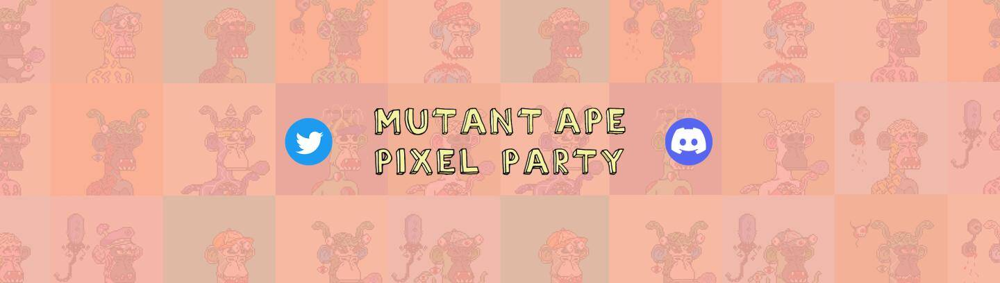

# MutantApePixelParty

Mutant Ape Pixel Party 在 Polygon 网络上独家收集 2000 个 NFT！每一个都是独一无二的算法生成的，并允许访问将随着时间的推移而显示的仅限会员的福利。

Mutant Ape Pixel Party NFT - 常见问题（FAQ）
▶ 什么是突变猿像素派对？
Mutant Ape Pixel Party 是一个 NFT（Non-fungible token）集合。存储在区块链上的数字艺术品集合。
▶ 有多少个 Mutant Ape Pixel Party 代币？
总共有 1,997 个 Mutant Ape Pixel Party NFT。目前，336 位所有者的钱包中至少有一个 Mutant Ape Pixel Party NTF。
▶ 最近卖出了多少个 Mutant Ape Pixel Party？
过去 30 天内共售出 0 个 Mutant Ape Pixel Party NFT。
▶ 什么是流行的 Mutant Ape Pixel Party 替代品？
许多拥有 Mutant Ape Pixel Party NFT 的用户还拥有 Bored Ape Pixel Party、 Bored Ape Picasso Yacht Club、 Real Mutant Apes和 Artist Mone Mutant Ape。

