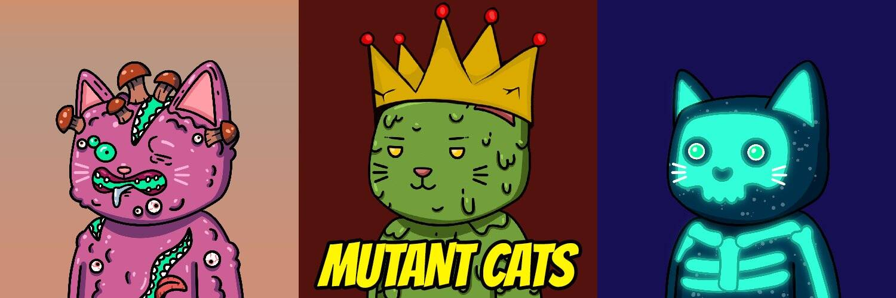

# Mutant Cats

您好猫爱好者，这次我们在世界标准时间 10 月 23 日下午 6 点 30 分开始与 5000 只突变猫一起在多边形链上，在 Matic 为时已晚之前抓住您最喜欢的突变猫。

Polygon/Ethereum 区块链上共有 9,999 只猫因疾病而发生变异。每只 Mutant Cat 都授予对 DAO 独家社区的访问权和对 DAO 资产的投票权。所有者数量：目前，我们是新的多边形链，从 UTC 时间 10 月 23 日下午 6:30 开始直播，以减少对我们的猫爱好者的交易费用，OpenSea 显示的所有者统计数据对于这个系列是不准确的。包括质押的 Mutant Cat 持有者在内的真实数字接近 5k。

